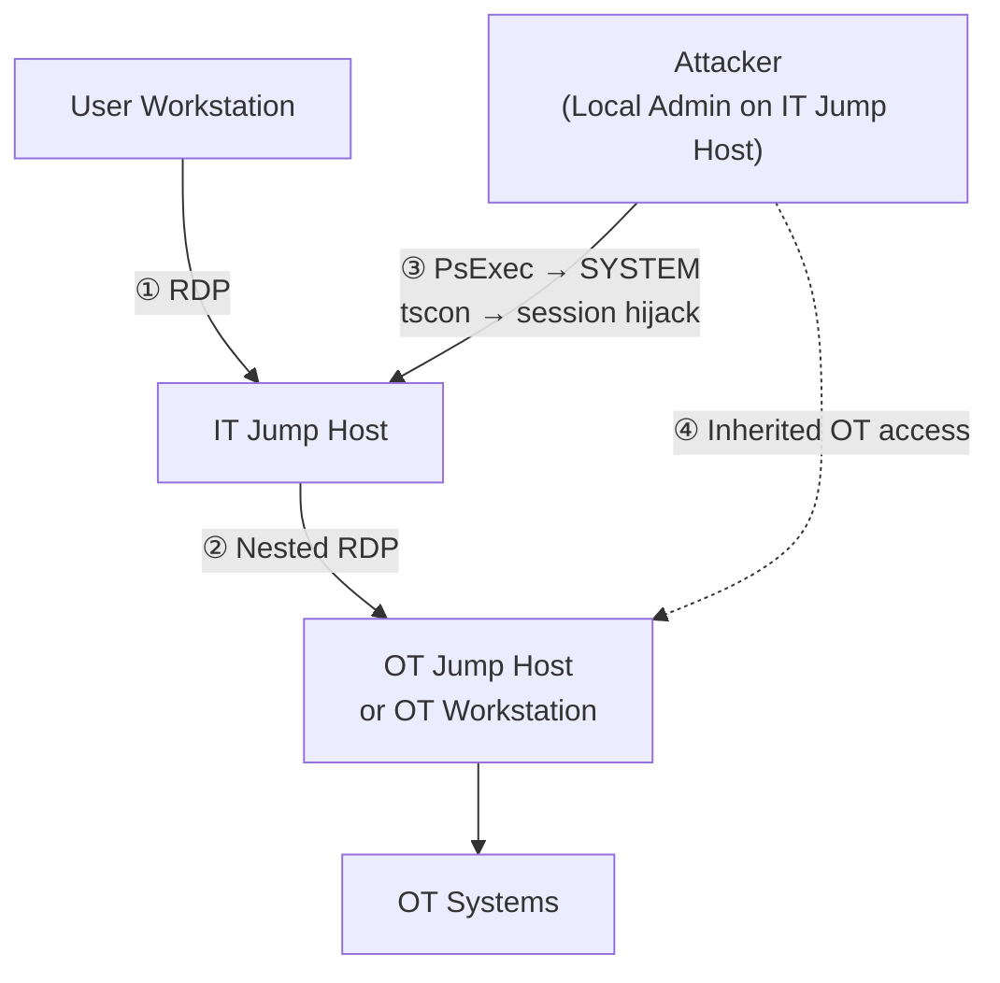
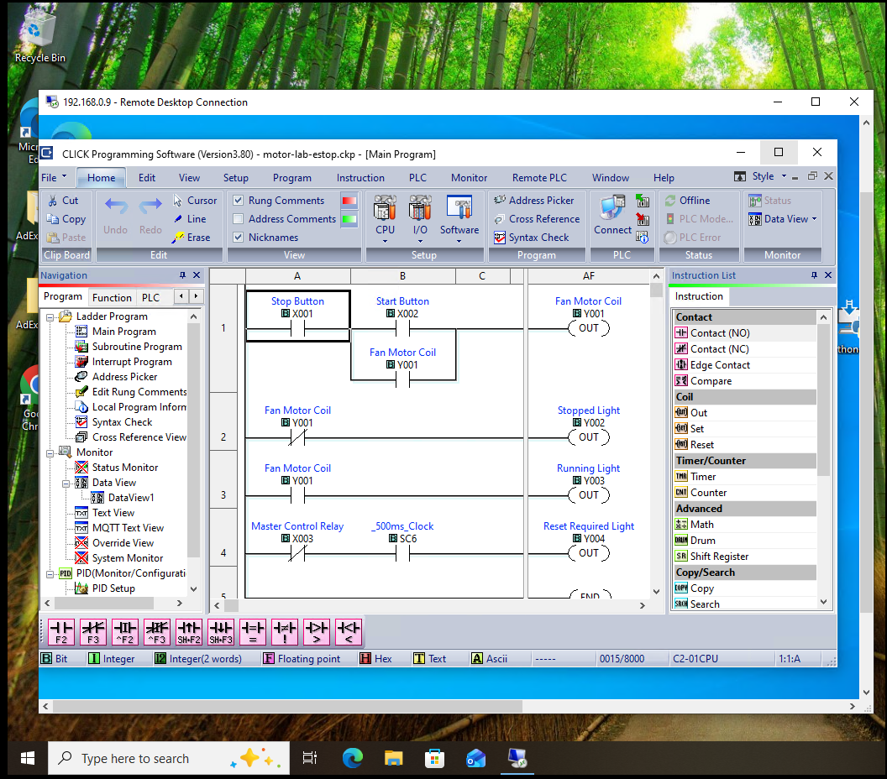

# OT Jumphost RDP Session Hijacking with tscon

*Performed in an isolated lab environment for authorized security testing.*

Watch the [LIVESTREAM](https://www.youtube.com/live/JVqw_jL7g28) where we attacked the Kit with Seth!

</img>

## Why This Matters

RDP jump hosts are a cornerstone of OT remote access architecture. The idea is sound: no remote laptop ever talks directly to a PLC. All sessions must pass through a hardened intermediary.

The problem is that "hardened intermediary" makes the jump host one of the most valuable targets in the environment. An attacker who gains local administrator access to an IT jump host does not need to crack OT credentials, pivot through the network, or exploit a protocol vulnerability.

They just need to wait for a user to disconnect from their session without logging off — and then step into it.

This technique uses `tscon`, a built-in Windows utility, to reconnect a disconnected RDP session while running as `NT AUTHORITY\SYSTEM`. **No password is required.** If the victim left a nested RDP connection to an OT host open inside their desktop, the attacker inherits that connection too.

## Lab Architecture

| System | Purpose |
|---|---|
| User Workstation | Initiates the inbound RDP connection to the IT jump host |
| IT Jump Host | Windows Server; the session hijack occurs entirely on this host |
| OT Jump Host / OT Workstation | Target OT system reached via the victim's nested RDP session |
| OT Systems | PLCs, HMIs, historians, and controllers |

The architecture that enables this attack is layered RDP:



The victim's inbound RDP session at step ① is disconnected — not logged off. Their nested OT connection at step ② may still be live inside that desktop. The attacker uses steps ③ and ④ to inherit both without ever touching the network path between the user's workstation and the jump host.

## What This Attack Is Not

This is not a network man-in-the-middle attack.

The attacker never intercepts traffic between the user's workstation and the jump host. There is no ARP spoofing, no TLS stripping, and no proxy involved. The hijack happens **entirely on the IT jump host**, after the victim has already disconnected.

Network segmentation, encrypted RDP, and MFA at the perimeter do not prevent this once the attacker holds administrator access on the jump host itself. The attack lives inside the host, not on the wire.

## Prerequisites

- A Windows account with local administrator rights on the IT jump host
- [PsExec](https://learn.microsoft.com/en-us/sysinternals/downloads/psexec) from the Sysinternals suite, present on the jump host (see Troubleshooting for an alternative if it is unavailable)
- A victim user who has disconnected their RDP session without logging off

## The Attack

### Step 1: Query Active Sessions on the IT Jump Host

Log in to the IT jump host as a local administrator, or if already on the system, open an elevated Command Prompt.

List all active and disconnected sessions:

```cmd
query session
```

The output will look similar to this:

```text
 SESSIONNAME       USERNAME          ID  STATE   TYPE
 services                             0  Disc
 console                              1  Conn
>rdp-tcp#3        attacker            3  Active  rdpwd
 rdp-tcp#1        victim              2  Disc    rdpwd
```

The `>` marks your current active session. The session showing `Disc` under STATE with a recognizable username is the victim's disconnected session. Note the **session ID** in the `ID` column — you will need it in Step 4.

> **What "Disc" means:** The user closed their RDP client or lost connectivity but did not log off. Their session — along with every open application, window, and connection inside it — is still running on the server.

### Step 2: Get a SYSTEM Shell with PsExec

A local administrator account is not enough. `tscon` requires `NT AUTHORITY\SYSTEM` to reconnect another user's session without supplying their credentials. We use PsExec to elevate.

From an elevated Command Prompt on the jump host:

```cmd
PsExec64.exe -s cmd.exe
```

PsExec launches a new Command Prompt running under the SYSTEM account.

> **Why SYSTEM?** `tscon` enforces session ownership for normal accounts — a standard administrator can only reconnect their own session. SYSTEM sits above that enforcement boundary. PsExec with the `-s` flag delegates execution to the SYSTEM account, which bypasses the ownership check.

> **Caution**: For some reason, `psexec.exe` did not work for me. It took a good while on the Livestream to figure out the issue. Switching to `psexec64.exe` did the trick.

### Step 3: Verify SYSTEM-Level Access

In the new shell, confirm the running identity:

```cmd
whoami
```

Expected output:

```text
nt authority\system
```

If you see an administrator account name instead, the shell is not running as SYSTEM. Stop and revisit Step 2 before continuing.

### Step 4: Hijack the Disconnected Session

From the SYSTEM shell, run `tscon` with the victim's session ID and the name of your current active session as the destination:

```cmd
tscon <VICTIM_SESSION_ID> /dest:<YOUR_SESSION_NAME>
```

For example, if the victim's session ID is `2` and your current session name is `rdp-tcp#3`:

```cmd
tscon 2 /dest:rdp-tcp#3
```

I just did:
```cmd
tscon 2
```

And the user's session loaded right up!

Your RDP window will immediately switch to the victim's desktop. No password prompt appears. No warning is presented to the user.

</img>

### Step 5: Inspect the Inherited Desktop

Once inside the victim's desktop, look for any open RDP connections to OT hosts. These connections may appear as full-screen RDP windows, minimized taskbar entries, or active Remote Desktop Connection sessions.

If the victim's nested RDP session to the OT jump host or OT workstation is still open, you now have interactive control over it. You did not authenticate to that OT host. You did not need the victim's OT credentials. You walked into a room the victim left unlocked — with the door to the OT network still open behind them.

## Why tscon Works Without a Password

Windows RDP sessions are owned by the user account that created them. `tscon` is the legitimate Windows utility for reconnecting or transferring those sessions — operators and kiosk administrators use it for session management every day.

When a **normal user** calls `tscon`, Windows enforces session ownership: you can only reconnect your own session.

When **SYSTEM** calls `tscon`, that ownership check is bypassed entirely. The SYSTEM account exists above any individual user account in the Windows privilege hierarchy and is not subject to per-session ownership rules.

This is not a bug. It is how Windows is designed to work. The SYSTEM account is trusted to manage the machine. The security failure is allowing an attacker to reach SYSTEM on a shared access jump host in the first place.

## What We Observed

The `tscon` command connected the victim's disconnected session to our active RDP window without any credential prompt.

The desktop that appeared was the victim's session, exactly as they had left it — with all open windows, running applications, and active network connections intact.

Any nested OT RDP connection open inside that desktop was immediately accessible through normal mouse and keyboard interaction.

## Detection Opportunities

- **Event ID 4688 (Process creation):** A `cmd.exe` process spawned with `PSEXESVC.exe` as the parent is a strong signal. PsExec is rarely used legitimately on a production jump host.
- **Event ID 4778 (Session reconnect):** A session reconnect event for a user who is not known to be reconnecting from their expected workstation is worth investigating.
- **Event ID 7045 (Service installation):** If the `sc.exe` service method was used instead of PsExec, a new short-lived service will appear in the System event log immediately before the session transfer.
- **`tscon.exe` process creation:** `tscon` is almost never executed interactively on a production server. A SIEM rule or EDR alert on `tscon.exe` process creation will have an extremely low false-positive rate in most environments.
- **PSEXESVC service:** PsExec installs a temporary service named `PSEXESVC` on the host. Its creation and removal are both logged and auditable.

To be clear: none of these detections fire during the setup phase. The attacker only needs to act once the victim has disconnected. A monitoring gap between disconnect and reconnect could allow this to go undetected.

## Troubleshooting

### Problem: PsExec is not available on the jump host

**Symptoms**

`PsExec.exe` is not present and the host cannot reach the internet to download it.

**Cause**

PsExec was not placed on the host, or application whitelisting prevents its execution.

**Resolution**

Use `sc.exe` to create a short-lived Windows service. Services run as SYSTEM by default, which satisfies the `tscon` privilege requirement:

```cmd
sc create hijack binpath= "cmd.exe /k tscon <VICTIM_SESSION_ID> /dest:<YOUR_SESSION_NAME>"
sc start hijack
sc delete hijack
```

The service starts, executes `tscon`, and your window switches to the victim's desktop. Delete the service immediately to reduce forensic exposure.

---

### Problem: `tscon` returns "Access is denied"

**Symptoms**

```text
Session name: rdp-tcp#1
Error [5]:Access is denied.
```

**Cause**

The shell running `tscon` is not elevated to SYSTEM. A local administrator shell alone is not sufficient.

**Resolution**

Return to Step 2. Run `PsExec.exe -s cmd.exe` again, then verify `whoami` returns `nt authority\system` before retrying `tscon`.

---

### Problem: The victim's session ID is not visible in `query session`

**Symptoms**

Only your own session and the services session appear. The expected victim username is not listed.

**Cause**

The victim has fully logged off, their session timed out, or the environment uses Remote Desktop Services session brokering across multiple hosts.

**Resolution**

Confirm the victim disconnected rather than logging off. If the environment brokers sessions across an RDS farm, you will need to identify which specific host is holding the session.

## Security Takeaways

1. **OT Remote Desktop Protocol (RDP) should not be exposed to IT.** Instead, use a commercial, purpose-built OT remote access system. They have a ton of great security and auditing features you'll find really useful.

2. ***Architecture, Architecture, Architecture.*** Follow recognized design guides, like the [CPwE](https://literature.rockwellautomation.com/idc/groups/literature/documents/td/enet-td009_-en-p.pdf)!


2. **Session disconnect is not session logout.** Train remote access users to log off completely when their work is done. Disconnecting leaves the entire desktop — including any nested OT connections — running and exposed on the server.

3. **Enforce idle and disconnected session timeouts.** Group Policy can automatically log off disconnected sessions after a defined period. Configure `Set time limit for disconnected sessions` under Computer Configuration → Administrative Templates → Windows Components → Remote Desktop Services. A 15-minute timeout significantly reduces the exposure window.

4. **Jump host local administrator access is crown-jewel access.** Once an attacker holds local admin on a shared access host, credential-less session takeover is a few commands away. Treat jump host administrator accounts with the same rigor as OT system credentials.

5. **Consider session recording and isolation.** Purpose-built remote access platforms such as Apache Guacamole, CyberArk Privileged Access Manager, or BeyondTrust Privileged Remote Access can enforce session timeouts, record everything, and prevent users from carrying open connections beyond their authorized scope.

## References

- [tscon — Microsoft Documentation](https://learn.microsoft.com/en-us/windows-server/administration/windows-commands/tscon)
- [PsExec — Microsoft Sysinternals](https://learn.microsoft.com/en-us/sysinternals/downloads/psexec)
- [query session — Microsoft Documentation](https://learn.microsoft.com/en-us/windows-server/administration/windows-commands/query-session)
- [MITRE ATT&CK T1563.002 — Remote Service Session Hijacking: RDP Hijacking](https://attack.mitre.org/techniques/T1563/002/)
- [Hacking OT Networks: A Practical Guide To Pentesting Industrial Networks](https://a.co/d/0etO4KzE), by Christopher Nourrie
- [Industrial Control System Security, Volume 1](https://www.amazon.com/Industrial-Cybersecurity-Efficiently-critical-infrastructure-ebook/dp/B0761XRTP9), by Pascal Ackerman
- [Cisco Converged Plantwide Ethernet - Industrial DMZ](https://literature.rockwellautomation.com/idc/groups/literature/documents/td/enet-td009_-en-p.pdf), by Cisco and Rockwell Automation
