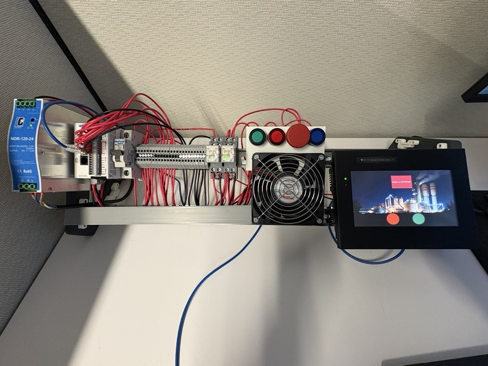
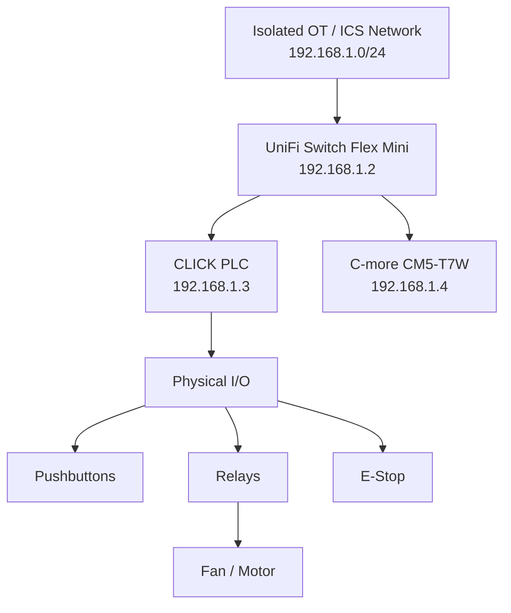
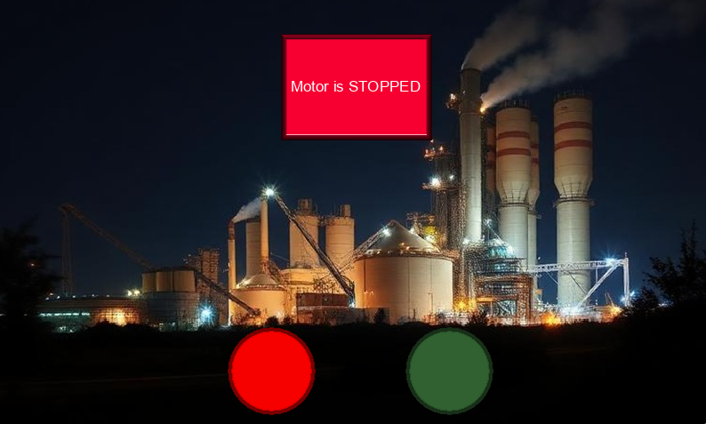
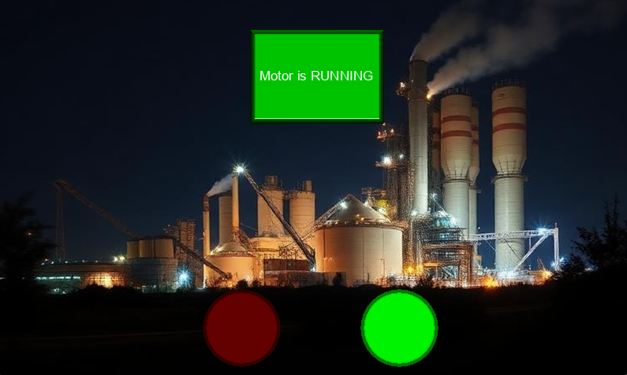
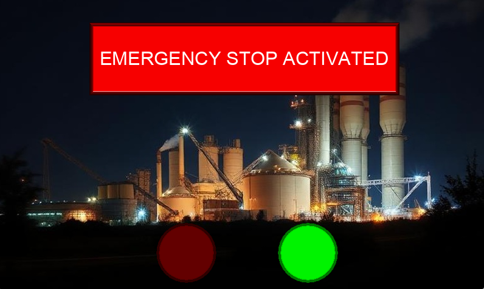

# PLC Trainer Kit — C-more CM5 HMI Build

This repository documents my personal build and extension of the Packets-or-it-didn't-happen PLC Trainer Kit, originally created by Oren Niskin / oniskin.

The original project provides an excellent hands-on platform for learning about Industrial Control Systems (ICS), Operational Technology (OT), PLC programming, industrial networking, Modbus TCP, HMI operation, and OT cybersecurity.

My build expands on the original design by adding a physical AutomationDirect C-more CM5-T7W 7-inch HMI and a UniFi Switch Flex Mini, creating a compact, isolated OT network that more closely represents the basic components found in an industrial control environment.

I've also included hands-on guides, visual references, HMI screenshots, and the project files for both the CLICK PLC and C-more HMI to make it easier for others to build, demonstrate, learn from, and modify the lab for their own environment.

💡 Free Programming Software: Both the CLICK PLC Programming Software and C-more CM5 Programming Software are available free of charge from AutomationDirect, making it easier to use the provided project files and customize the lab without purchasing separate PLC or HMI development software.

Original Project:
https://github.com/oniskin/PLC-Trainer-Kit

## 🧰 My OT Lab

Below is my completed OT Lab build with the physical CLICK PLC, C-more CM5-T7W HMI, controls, relays, networking, and simulated motor/process installed.



The lab is designed to provide a small but functional representation of a common manufacturing OT/ICS environment.

Users can interact with the physical controls, operate the process through the HMI, examine the PLC logic, observe network communications, and experiment with the supplied project files.

## 🏭 About This Build

The goal of this build was to create a compact but realistic OT/ICS training environment using actual industrial control components.

In addition to the original PLC Trainer Kit concepts, this version incorporates a dedicated physical HMI rather than relying exclusively on a software-based HMI.

The physical HMI allows the lab to demonstrate the interaction between:

Operator → HMI → PLC → Field Devices

The PLC and HMI are connected through a UniFi Switch Flex Mini, providing a dedicated Layer 2 Ethernet network for the lab.

The entire environment is designed to operate as an isolated OT lab. The core devices use static IPv4 addresses and do not depend on DHCP, DNS, Internet access, or other enterprise network services for normal operation.

This provides a useful environment for learning both industrial automation and OT cybersecurity concepts.

## ⚙️ Lab Components

My version of the trainer includes the following major components:

Component

Purpose

24 VDC Power Supply

Provides control power for the trainer

AutomationDirect CLICK PLC

Executes the control logic

AutomationDirect C-more CM5-T7W

Physical operator HMI

UniFi Switch Flex Mini

Layer 2 Ethernet connectivity for the isolated OT network

Circuit Breaker

Electrical protection

Terminal Blocks

Field wiring distribution

Control Relays

Interface between PLC outputs and field devices

Start Pushbutton

Physical process start

Stop Pushbutton

Physical process stop

Emergency Stop

Simulated emergency shutdown

Reset Pushbutton

Resets the process after an emergency stop

24 VDC Fan / Motor

Represents a plant motor or industrial process

## 🏗️ Simplified Architecture



The trainer represents a simplified industrial environment where an operator interacts with a physical process through both local physical controls and an HMI.

## 🌐 Network Configuration

The lab uses a dedicated, isolated IPv4 network.

All core OT devices are configured with static IP addresses. This keeps the environment simple and predictable and eliminates the need for a DHCP server.

Network: 192.168.1.0/24
Subnet Mask: 255.255.255.0

Device

IP Address

Purpose

UniFi Switch Flex Mini

192.168.1.2

Layer 2 OT network switch

AutomationDirect CLICK PLC

192.168.1.3

Process controller

C-more CM5-T7W HMI

192.168.1.4

Operator interface

Additional engineering or cybersecurity workstations can be assigned unused static addresses within the same 192.168.1.0/24 network when required.

Because this is an isolated lab, a default gateway or DNS server is not required for normal PLC-to-HMI communication.

Note: The 192.168.1.0/24 network is used specifically for this isolated training environment. If the lab is connected to another network for management, updates, demonstrations, or Internet access, appropriate routing, segmentation, and security controls should be implemented.

## 📚 Guides — Start Here

The Guides folder contains the documentation and hands-on instructions provided with the project.

If you're new to PLCs, HMIs, or OT environments, I recommend starting with the Welcome to the OT Lab guide before modifying the PLC or HMI projects.

The guides include:

Welcome to the OT Lab — Introduction to the lab, its components, and hands-on operation.

Export CLICK PLC Tags — Instructions for exporting nicknames/tags from the CLICK PLC.

Import CLICK Tags to C-more — Instructions for importing the exported PLC tags into the C-more HMI project.

## 🏭 Welcome to the OT Lab

The Welcome to the OT Lab guide provides an introduction to the trainer and the basic concepts of an OT/ICS environment.

Rather than simply describing the components, the guide is designed to be hands-on. It walks users through the lab step by step so they can interact with the equipment and see how the PLC, HMI, physical controls, and simulated process work together.

While following the guide, users can reference the actual lab photo and Manufacturing Control System Components Overview infographic located under the Images folder.

The guide introduces:

The major components of the OT Lab

The role of the PLC

The role of the HMI

Physical inputs and outputs

Industrial Ethernet communications

Starting and stopping the simulated process

Using the physical controls

Using the C-more HMI

Activating the Emergency Stop

Resetting the system

Observing how the physical process responds to PLC logic

The goal is to first understand how the process operates normally before moving into networking, troubleshooting, or cybersecurity exercises.

## 🖼️ Manufacturing Control System Components Overview

I've provided a Manufacturing Control System Components Overview infographic under the Images folder.


The infographic provides a visual reference for the major components represented in the OT Lab and helps users connect the physical equipment they see on the trainer with the role each component typically performs within a manufacturing or industrial control environment.

The infographic identifies:

Power Supply

PLC

Circuit Breaker

Terminal Blocks

Relays

Start Button

Stop Button

Emergency Stop Button

Reset Button

Fan / Motor

HMI

Using the Infographic

The infographic can be used in two primary ways.

During an OT Lab demonstration: Use the infographic as a visual aid when introducing the trainer to users. Walk through each component and explain its purpose before demonstrating how the complete control system operates.

With the Welcome to the OT Lab guide: Users can reference the infographic while following the hands-on exercises in the guide. This makes it easier to identify the physical components referenced throughout the exercises.

Together, the actual lab photo, infographic, and Welcome guide provide a simple learning progression:

See the Lab → Identify the Components → Understand Their Purpose → Operate the Process → Observe How Everything Works Together

## 🖥️ C-more CM5 HMI

The primary addition to this build is a physical AutomationDirect C-more CM5-T7W 7-inch HMI.

The HMI communicates with the CLICK PLC across the isolated Ethernet network and provides the operator interface for controlling and monitoring the simulated process.

The HMI allows users to:

Start the simulated motor/process

Stop the simulated motor/process

Monitor whether the motor is running or stopped

View Emergency Stop status

Reset the process following an Emergency Stop

Observe PLC input and output states

Demonstrate HMI-to-PLC communications

Compare physical pushbutton commands with HMI commands

The interface provides visual feedback so users can see how changes in the PLC-controlled process are reflected at the operator interface.

## 🎛️ HMI Operating States

Screenshots of the major HMI operating states are provided under the Images folder.

These are useful both as documentation and as a reference when demonstrating how the HMI responds to changes in the physical process.

### ⏹️ Motor Stopped

During normal operation with the motor stopped, the HMI indicates that the process is ready but the simulated motor is not currently running.



From this state, the user can start the process using either the appropriate physical control or the HMI.

### ▶️ Motor Running

When the process is started, the HMI changes to indicate that the simulated motor is currently running.



This demonstrates how the HMI receives process information from the CLICK PLC and provides the operator with visual feedback about the current state of the equipment.

The process can then be stopped using either the physical STOP button or the appropriate HMI control.

### 🛑 Emergency Stop Activated

When the physical Emergency Stop is activated, the PLC detects the condition and the HMI displays the Emergency Stop state.



While the Emergency Stop condition is active:

The simulated motor is stopped.

Normal START commands are prevented.

The HMI provides a visible indication that the Emergency Stop has been activated.

Normal operation cannot resume until the Emergency Stop condition has been cleared.

Because the Emergency Stop button is latching, simply pressing RESET will not clear the condition.

To recover:

Rotate the Emergency Stop button to physically unlatch it.

Press the RESET button.

Allow the PLC logic to clear the Emergency Stop condition.

Verify that the HMI returns to the appropriate operating state.

This provides a hands-on demonstration of the relationship between a physical field device, PLC logic, HMI status, and the resulting physical process.

Training Lab Notice: The Emergency Stop implementation in this lab is intended for educational process simulation. It should not be interpreted as a design example for a production safety system. Actual machinery requires appropriate safety-rated components, engineering, risk assessment, and compliance with applicable standards.

## 🔄 CLICK PLC to C-more Tag Guides

The Guides folder also contains instructions for transferring tag information between the AutomationDirect CLICK PLC and C-more HMI.

Exporting Tags from the CLICK PLC

The export guide provides step-by-step instructions for exporting PLC tags for use with the C-more HMI.

For easier export and import, use the Export Nickname option in CLICK Programming Software.

Make sure that a nickname has been assigned to all tags you want to use before performing the export.

Importing Tags into the C-more HMI

The corresponding import guide walks through importing the exported CLICK PLC tags into the C-more programming environment.

Using the exported nicknames makes it easier to maintain meaningful tag names between the PLC and HMI instead of manually recreating addresses and descriptions.

These guides are especially useful if you want to modify the provided projects or use this repository as the starting point for your own trainer.

## 🆓 Programming Software

One of the advantages of this OT Lab is that the programming software required for both the CLICK PLC and C-more CM5 HMI is available free of charge from AutomationDirect.

This makes the lab easier to reproduce without requiring additional PLC or HMI development software licensing costs.

CLICK Programming Software

The CLICK Programming Software is used to configure and program the AutomationDirect CLICK PLC.

It can be downloaded for free from the AutomationDirect website and can be used to:

Open and modify the provided PLC project

Review the ladder logic

Monitor PLC inputs and outputs

Modify the process control logic

Configure PLC communications

Assign and manage nicknames

Export nicknames/tags for use with the C-more HMI

Download changes to the PLC

Tip: If you plan to export PLC tags for use with the C-more HMI, assign meaningful nicknames to your CLICK addresses first. The Export Nickname option provides an easy way to transfer this information into the C-more project.

C-more CM5 Programming Software

Like the CLICK PLC programming software, the C-more CM5 Programming Software is also available free of charge from AutomationDirect.

The C-more software is used to configure and program the C-more CM5-T7W HMI included in this build.

It can be used to:

Open and modify the provided HMI project

Create and modify HMI screens

Configure the CLICK PLC connection

Import PLC tags/nicknames

Add buttons, indicators, alarms, and other HMI objects

Map HMI objects to PLC addresses

Test changes to the HMI project

Download the project to the physical CM5-T7W

Both programming packages can be obtained from the AutomationDirect website.

Note: Make sure you download the current software version that supports your specific CLICK PLC and C-more CM5 hardware.

## 💾 Project Files

The Project Files folder contains the actual project files used in my lab for both the:

AutomationDirect CLICK PLC

AutomationDirect C-more CM5-T7W HMI

These files provide a working starting point rather than requiring you to recreate the PLC logic and HMI configuration from scratch.

Combined with the free programming software available from AutomationDirect, the project files make it easier to reproduce the lab and begin experimenting with the environment.

A basic workflow is:

Download the files from the Project Files folder.

Download and install the free CLICK Programming Software from AutomationDirect.

Download and install the free C-more CM5 Programming Software from AutomationDirect.

Open the provided CLICK PLC project.

Open the provided C-more HMI project.

Review the PLC logic and HMI configuration.

Connect your programming workstation to the isolated OT Lab network.

Modify the projects as desired for your own lab.

Feel free to experiment.

The project files are provided as a starting point. Play around with the PLC logic, modify the HMI screens, add additional tags, create new controls, change the network configuration, or adapt the projects to fit your own OT Lab environment.

Part of the purpose of this project is to encourage hands-on learning. Breaking things, troubleshooting them, changing the logic, and figuring out why something behaves differently than expected are all part of learning how OT systems work.

## 📂 Repository Structure

The repository has been intentionally kept simple and is organized into three primary folders:

```text
C-more CM5 HMI Build/
│
├── Guides/
│   ├── Exporting Tags from a CLICK PLC to a CSV File.md
│   ├── Importing CLICK PLC Tags into a C-more HMI.md
│   └── Welcome to the OT Lab.md
│
├── Images/
│   ├── HMI_Emergency_Stop_Activated.png
│   ├── HMI_Motor_Running.png
│   ├── HMI_Motor_Stopped.png
│   ├── Manufacturing_Control_System_Components_Overview.png
│   └── OT_Lab.jpg
│
├── Project Files/
│   ├── Click PLC/
│   │   ├── PLC_OT_Lab.ckp
│   │   └── PLC_OT_Lab.csv
│   └── C-more HMI/
│       └── HMI_OT_Lab.eapv
│
├── LICENSE
└── README.md
```

Guides

Contains the documentation and hands-on instructions for learning about, configuring, and using the OT Lab.

Images

Contains the OT Lab photo, Manufacturing Control System Components Overview infographic, and C-more HMI screenshots used throughout this README and the training materials.

Project Files

Contains the working CLICK PLC and C-more CM5 HMI project files.

These files can be opened and modified using the corresponding free AutomationDirect programming software.

## 🧪 Suggested Learning Path

If this is your first time using the lab, the following sequence provides a good starting point:

View Images/OT_Lab.jpg to become familiar with the overall trainer.

Review Images/Manufacturing_Control_System_Components_Overview.png.

Open the Welcome to the OT Lab guide under the Guides folder.

Identify each physical component on the trainer.

Operate the process using the physical controls.

Operate the same process from the C-more HMI.

Compare the Motor Stopped, Motor Running, and Emergency Stop HMI states.

Observe how the HMI, PLC, and physical process interact.

Install the free CLICK and C-more programming software.

Open the supplied projects from the Project Files folder.

Review the PLC logic and HMI configuration.

Use the tag export/import guides under the Guides folder to understand how PLC tags are mapped into the HMI.

Modify the PLC logic or HMI screens and experiment with your own configuration.

Begin exploring the networking and OT cybersecurity aspects of the environment.

The overall learning progression is:

See It → Identify It → Operate It → Understand It → Modify It → Secure It

## 🔐 OT Cybersecurity Training

Once users understand how the process operates normally, the trainer can also serve as a controlled environment for introducing OT cybersecurity concepts.

Examples include:

OT asset identification

PLC and HMI communications

Industrial protocol analysis

Modbus TCP traffic

Passive network monitoring

Wireshark packet capture

Network segmentation

Differences between IT and OT environments

Detection engineering

Understanding cyber-physical impact

Observing how network activity relates to a physical process

A major benefit of a physical trainer is the ability to demonstrate that OT cybersecurity is not simply about protecting computers and network traffic.

Changes to an OT environment can potentially result in changes to a physical process.

For this reason, users should first learn how the lab operates normally before beginning cybersecurity exercises.

## 📚 What You Can Learn

This project can be used as an introduction to several industrial automation and OT cybersecurity concepts, including:

PLC fundamentals

Ladder logic

Digital inputs and outputs

Relays and control circuits

HMI design

HMI-to-PLC communications

Industrial Ethernet

Static IP addressing

Modbus TCP

OT network architecture

Asset identification

Network traffic analysis

Wireshark

OT cybersecurity fundamentals

Cyber-physical process interaction

Troubleshooting PLC and HMI communications

Because both the PLC and HMI projects are provided, users can move beyond simply operating the trainer and begin exploring how the system was built and how the individual components interact.

## 🙏 Credits

This project is based on the excellent PLC Trainer Kit created by Oren Niskin / Packets-or-it-didn't-happen.

Original repository:

https://github.com/oniskin/PLC-Trainer-Kit

The original project inspired this build and provided the foundation for creating an affordable, hands-on environment for learning PLCs, industrial networking, and OT cybersecurity.

My contribution focuses primarily on extending the trainer with:

A physical AutomationDirect C-more CM5-T7W HMI

A dedicated UniFi Switch Flex Mini Ethernet network

A documented static 192.168.1.0/24 OT Lab network

A hands-on Welcome to the OT Lab guide

A Manufacturing Control System Components Overview infographic

HMI screenshots demonstrating the major operating states

CLICK PLC tag export instructions

C-more HMI tag import instructions

Ready-to-use CLICK PLC and C-more HMI project files

The ability to modify both projects using free programming software from AutomationDirect

Hopefully these additions make the original project even easier for others to build, demonstrate, experiment with, and use as a hands-on OT learning environment.

## 🤝 Contributing and Experimenting

This repository is intended to share ideas with the OT, automation, and cybersecurity communities.

Feel free to use the provided project files as a starting point for your own lab.

Modify the PLC logic, redesign the HMI, add additional equipment, create new screens, develop new process simulations, change the networking, or build entirely new training exercises.

If you create something useful, consider sharing your improvements with the community so others can learn from them as well.

## ⚠️ Safety and Responsible Use

This project is intended for:

Education

Cybersecurity training

Industrial automation training

Home labs

Controlled demonstrations

Authorized security research

All cybersecurity exercises should be performed only against systems that you own or have explicit authorization to test.

Do not connect this trainer or security-testing equipment to production OT environments.

Industrial systems control physical processes. Techniques that appear harmless in a laboratory can cause equipment damage, process interruption, or safety hazards when performed against real industrial systems.

Training Lab Notice: The Emergency Stop implementation in this lab is intended for educational process simulation. It should not be interpreted as a design example for a production safety system. Actual machinery requires appropriate safety-rated components, engineering, risk assessment, and compliance with applicable standards.

## 📜 License

This fork retains the licensing requirements of the original PLC-Trainer-Kit project.

See the LICENSE file for details.