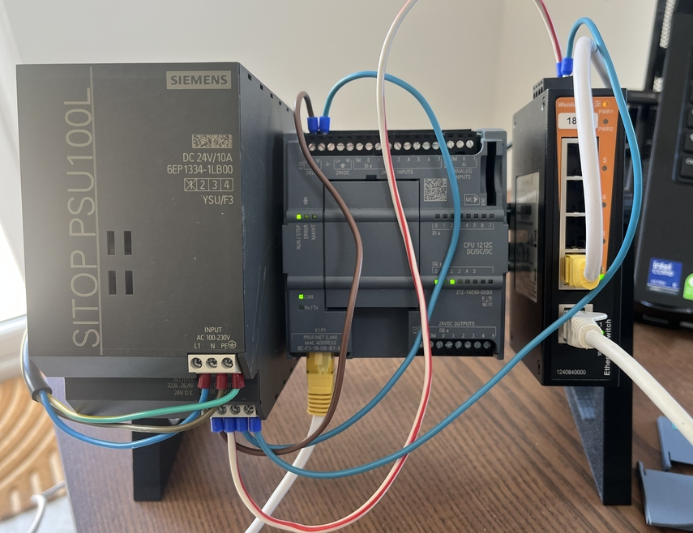
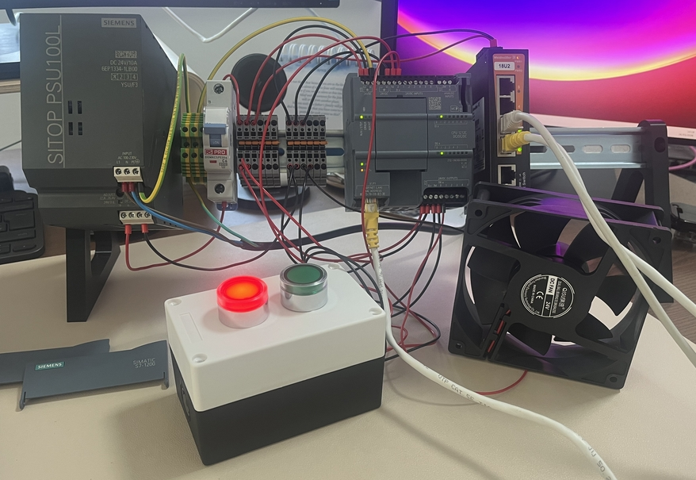
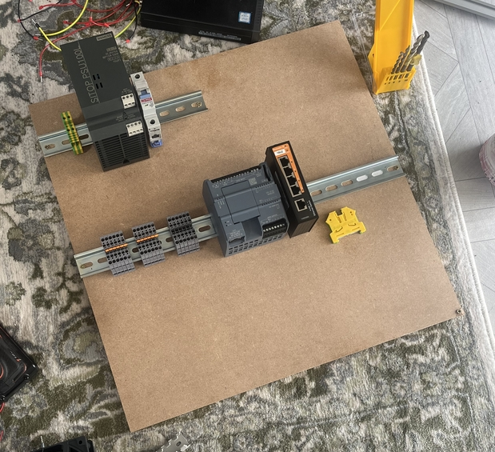
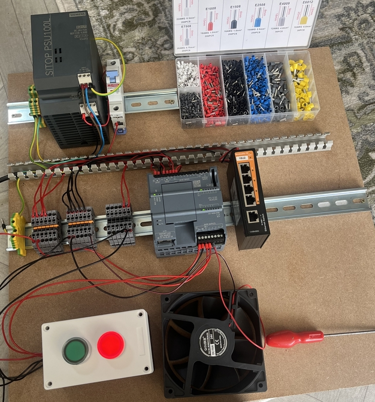
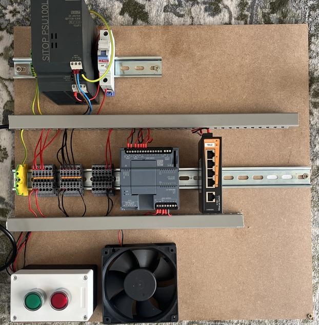
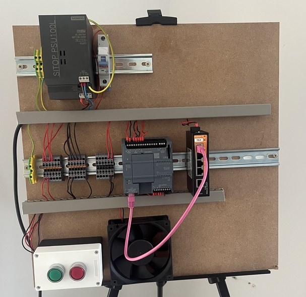
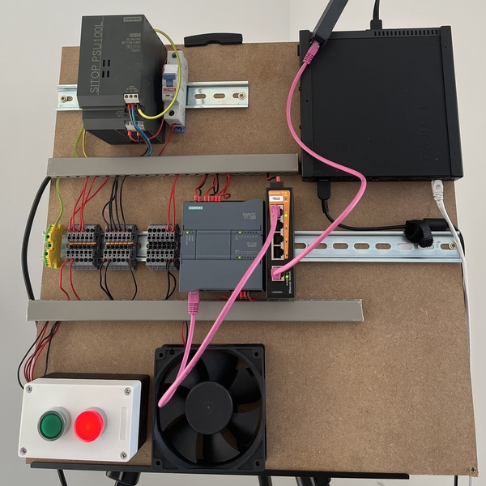

# cdino's S7-1200 PLC Lab

## Disclaimer

I am not an automation engineer. I don't have an electrical engineering background, I've never been trained in automation, PLCs, wiring, etc - I've learned all of this from colleagues, YouTube, and a little Claude. Please take what I say about wiring, PLC programming, terminal blocks, and so on with a healthy pinch of salt. If you spot something dumb or dangerous in my design, please get in touch - I'm genuinely keen to refine this as much as possible.

## Index

- [Bill of Materials](BOM.md)
- [Network](network.md)
- [Wiring](wiring.md)

## About

This project is put together by me, [Christopher Di-Nozzi](https://www.linkedin.com/in/christopher-d-794b35166/). My background is OT systems and security - I'm comfortable on a Linux machine or in Wireshark, but designing, wiring, and programming automation gear from scratch is a different world entirely. It's been a proper rabbit hole and I've enjoyed every bit of it. If you're on the fence about doing something similar, just start - you'll learn more from the mistakes than anything else.

The goal of this project is twofold: build something that mirrors a realistic industrial environment closely enough to be useful for security research and demonstration, and generate content for [Dead Band](https://cdino.net), my newsletter for OT security practitioners.

### Why the S7-1200?

I wanted to use real industrial gear rather than simulated environments - the realism matters when you're trying to understand how attacks actually work in production. The S7-1200 is still widely deployed across manufacturing sites and it supports a broad range of protocols:

- Modbus TCP
- OPC-UA
- S7 Communication (port 102)
- PROFINET
- HTTP/HTTPS
- SNMP
- ARP

If you're coming at this from a security background, that's exactly the point - more protocols means more attack surface, and more attack surface means more to learn. Each of those protocols has its own quirks, vulnerabilities, and security controls (or lack thereof), and having a physical device to test against makes the difference between reading about an attack and actually understanding it.

## Gallery

