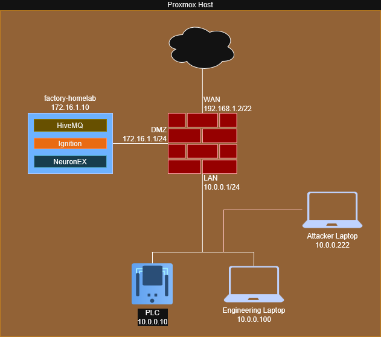

# Network


If, like me, you use a USB-to-Ethernet adapter to add extra NICs to your servers, make sure promiscuis mode is enabled for said adapter on the proxmox server!!!! (spent hours troubleshooting this...)

```
ip link set [nic] promisc on
```

also add the below to your /etc/network/interfaces file for the appropriate vmbr

```
post-up ip link set [nic] promisc on
```

## UNS System
As part of my build, I'm setting up a UNS system using HiveMQ. This is totally optionally, and much more of a manufacturing system, but I wanted to share it anyway in case it was of help.

I've included the [docker compose](docker-compose.yml) file (and my [Caddy](Caddyfile) file as reference) so you should be able to spin up my same set up pretty easily. 

Grab a makers license for Igniton. It's free and is better than the trial.