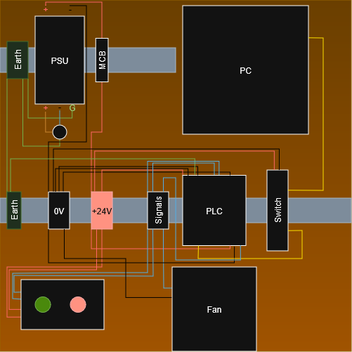

# Wiring

See the wiring diagram below. It's not the tidiest diagram in the world but it should give you a clear enough picture of how things connect.

Colour coding used in the diagram:

- **Red** - +24VDC
- **Black** - 0VDC
- **Blue** - signal (I actually used red and black for signal in my build - just be consistent within your own build and label things clearly)
- **Yellow** - Ethernet

You can arrange the physical layout however makes sense for your build. I went with power components on the top rail and everything else on the bottom, but there's no hard rule.

## I/O Mapping

| PLC Interface | Connected to |
|---------------|-------------|
| DI0 | Green button (input) |
| DI1 | Red button (input) |
| DO0 | Green LED (output) |
| DO1 | Red LED (output) |
| DO2 | Fan (output) |

The LED push buttons are wired as both inputs and outputs - the button contact goes to a digital input, and the LED inside the button is driven by a separate digital output. This means the PLC controls whether the LED is lit independently of whether the button is being pressed, which lets you use them as status indicators as well as inputs.

## A Note on NC vs NO Wiring

The green button is wired as **NC (normally closed)** and the red as **NO (normally open)**. This matters for how you write the ladder logic - an NC-wired button needs a normally-open contact (`] [`) in the ladder, not a normally-closed one, because the input is already energised at rest. It's the inverse of what you might expect and catches people out. If your buttons aren't behaving as expected, check this first.

## Safety

- Earth your DIN rails, PSU, and PLC chassis to a common earth point
- Use an MCB upstream of the PSU - it gives you overcurrent protection and a clean way to kill power to the whole panel
- The mains input to the PSU is live voltage - treat it accordingly. If you're not comfortable wiring mains, get someone who is to help with that part
- Bootlace ferrules on wire ends make a much more reliable connection in spring terminals than bare stranded wire - worth the small extra effort
