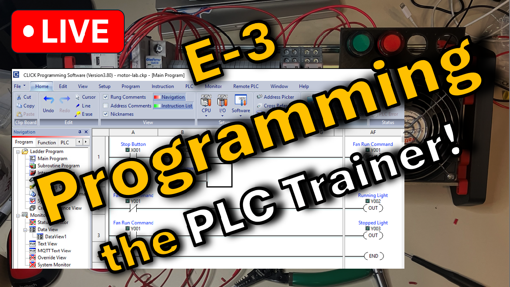
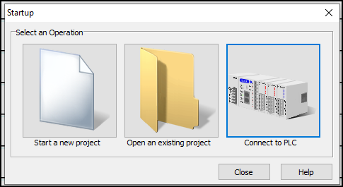
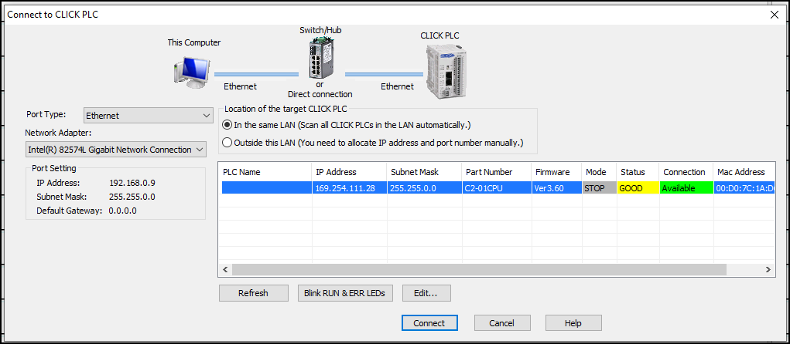
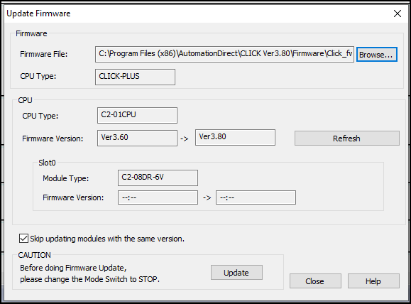
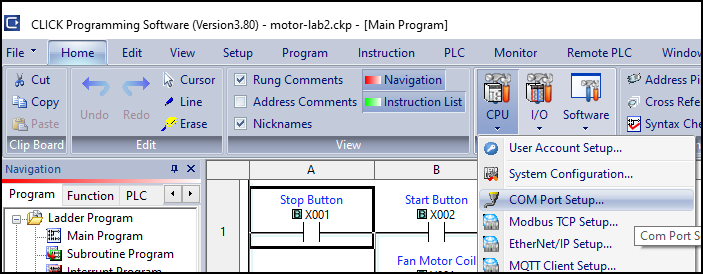
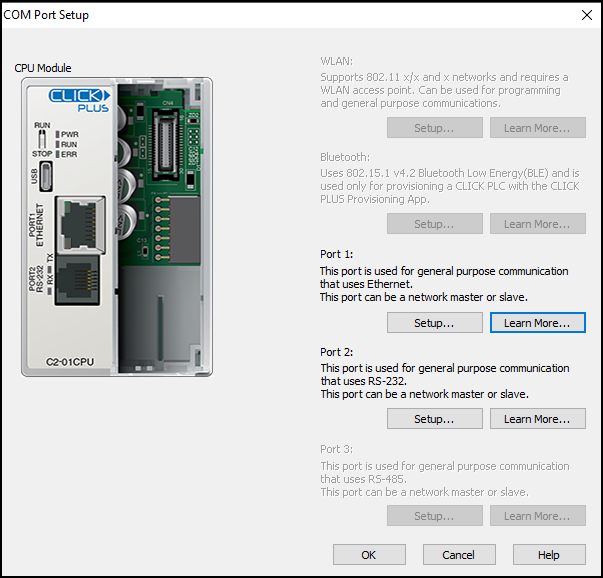
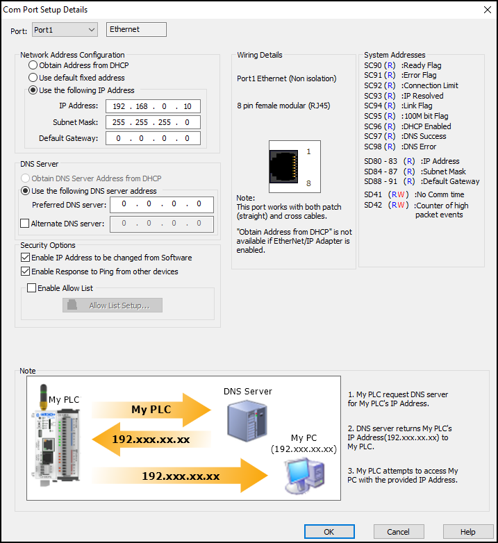
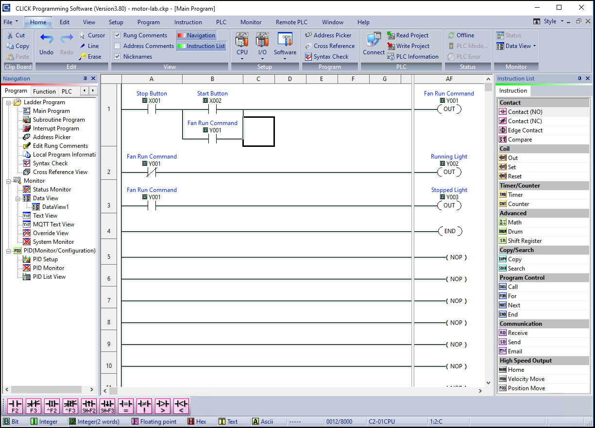

# Introduction.

You have your kit all wired up and ready to go.
Great job...

Now we get to the even FUNNER part!

Programming the PLC is where industrial logic comes to life. You'll take the physical hardware you've built and wired, and write the logic for a basic motor controller. 

The fundamentals you'll learn here are used in power plants, factories, and critical infrastructure worldwide.

In this guide, you'll learn ladder logic programming on a real, industry-standard PLC.

Watch the [LIVESTREAM](https://www.youtube.com/live/xun7izINi8M) on YouTube!



# Objectives. What you'll learn.

By the end of this guide, you should understand:
- Ladder logic programming
- Click PLC programming software and IDE
- Digital input and output logic
- How to configure your PLCs networking interfaces
- How to download and run programs on your PLC
- How to test and debug your PLC program

# Prerequisites & Software Setup

Before you start programming, you'll need the Click PLC software installed and connected to your hardware.

> [!NOTE]
> See the [Bill of Materials](../BOM.md) for software download links.

## Required Software:
- Click PLC Programming Software (Free) — Download from [Automation Direct](https://www.automationdirect.com/)
- Windows PC or Virtual Machine
- Ethernet connection from the Windows machine to your PLC

## Hardware Setup:
- Your completed and wired PLC kit
- 24VDC power supply connected and running
- All wiring verified and checked
- On the I/O module, the C1 light should be lit (meaning the stop button is not pressed). Pushing the Stop button should make this light go out.
- On the I/O module, the C2 light should NOT be lit (meaning the start button is NOT pressed). Pushing the Start button should make this light come on.

# Guide.

## Part 1: Connecting to your PLC for the first time

### Initial setup to connect to the PLC

OK, we were cheap and didn't buy the *$42* Automation Direct RS232 serial cable.
A true professional would use this cable to connect to the PLC via serial so that the initial networking config can be applied.

Since we don't have a cable, we need a workaround.

These PLCs are configured by default for DHCP. Since we don't have a DHCP server on our network, it will naturally fall back to what they call an *APIPA (Automatic Private IP Addressing)* address, which look like `169.254.x.x`.

Sooo, we will change our Windows - IP address to: 
- **IP**: `169.254.0.9`
- **Subnet Mask**: `255.255.0.0`
- No gateway necessary.
- No DNS servers necessary.

### Connecting to your PLC with the Click Programming Software

Open the Click PLC programming software installed previously.

You should see an option to "Connect to a PLC." Click that.



Now you should see a table of Click PLCs available on the network. If you see a PLC, you're ***WINNING!*** Great job.



Click that PLC and click "Connect"

The default password is in the picture. :smiley: use it.

Congrats! You're Connected.

### Updating your PLC's firmware

<<<<<<< HEAD
Click **PLC** -> **Update Firmware** on the top menu.


A dialog will open with the following information comparing the installed firmware with the manufacturer's latest releases.



Click Update.

=======


>>>>>>> a591f99172f712579a1b31199fadc6304bee55fa
### Configuring your PLC's networking interface

Update your PLCs IP address to:

<<<<<<< HEAD
Click **Home** -> **PLC** Dropdown -> **Comm Port**



This will open a dialog to select which comm port you want to configure.

Click **Setup** for **Port 1 - Ethernet**



Configure Port 1 as follows:

=======
>>>>>>> a591f99172f712579a1b31199fadc6304bee55fa
- **IP**: `192.168.0.10`
- **Subnet Mask**: `255.255.255.0`
- **Gateway**: Not required.
- **DNS Servers**: Not required.

<<<<<<< HEAD


=======
>>>>>>> a591f99172f712579a1b31199fadc6304bee55fa
You can test this with a ping command from your Engineering Workstation:
```
ping 192.168.0.10
```
## Part 2: Programming your first Ladder Logic application

Create the following PLC program using the Click programming software GUI:



### Ladder Logic Basics

#### Terminology

- Rung - Each line of a Ladder Logic program.

#### Normally Open (NO) Contacts

Normally Open (NO) switch contact 
- At rest, when the button is not pushed, electric current is not allowed to pass. The switch is open.
- When the button is pushed, electric current IS allowed to pass. The switch is closed.

The START button is NO.

#### Normally Closed (NC) Contacts

Normally Closed (NC) switch contact
- At rest, when the button is not pushed, electric current IS allowed to pass. The switch is closed.
- When the button is pushed, electric current IS NOT allowed to pass. The switch is open.

The STOP button is NC.

### Programming the logic.

Click in the menu on the right to drag two NO contacts onto the top Ladder *Rung*.

Quick question. WHY, oh WHY, would we have **2** NO contacts?
1 for the START button and one for the STOP button.
But wait! I thought the STOP button was NC??

Crazy part: It is. Physically, the STOP switch is NC. Therefore, when the button is not pressed, current is allowed through the switch and the input is activated (set to TRUE).

So, for our program to work, we need to make the STOP contact NO in the Ladder Logic.

Confused? Just think of it like this. Normally Closed switch inverts the signal (not pressed = input turns true).

If we also had NC in the program, this would turn the value BACK to false.

It's kind of like multiplying by -1. If you do it twice, you're back to where you started.

Confused? You can read more [here](https://www.plcacademy.com/normally-closed-stop-button/).

## Part 3: Running Your First Program - Input/Output Control

### Downloading and Uploading explained.

### Downloading the program to the PLC.

## Part 5: Testing & Debugging

### Running Your Program

### Monitoring Inputs and Outputs

### Common Issues & Troubleshooting

# Conclusion

You've now learned the fundamentals of PLC programming with real industrial hardware. The ladder logic concepts you've mastered here scale to control systems managing everything from water treatment plants to oil refineries.

# Next Steps

Ready to take it further?

Next, we're going to install and program an [Ignition](https://inductiveautomation.com) Gateway HMI server!

Watch for upcoming guides on these advanced topics!
