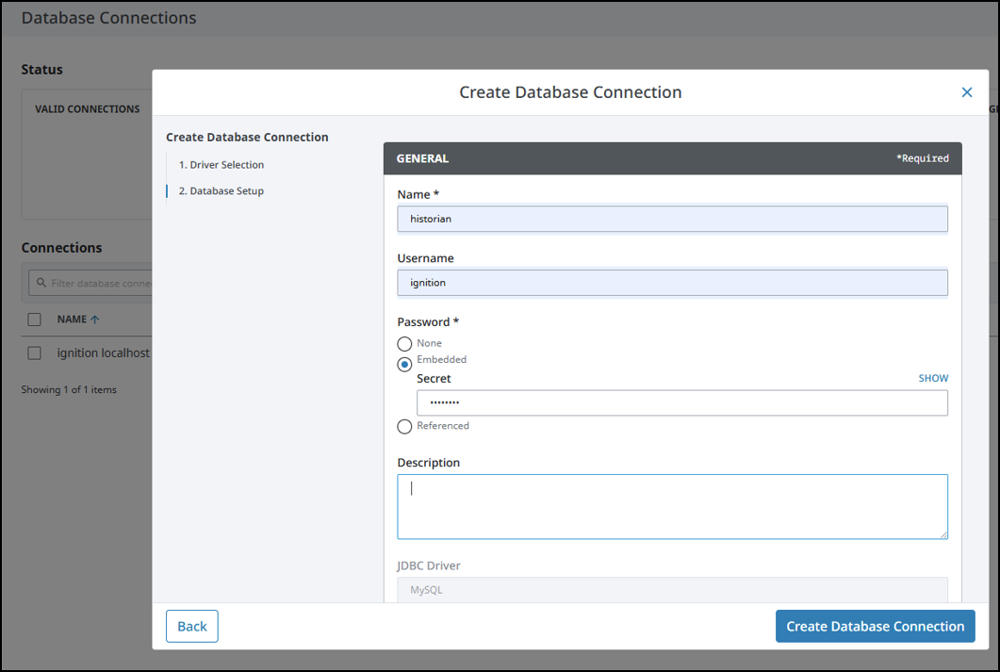
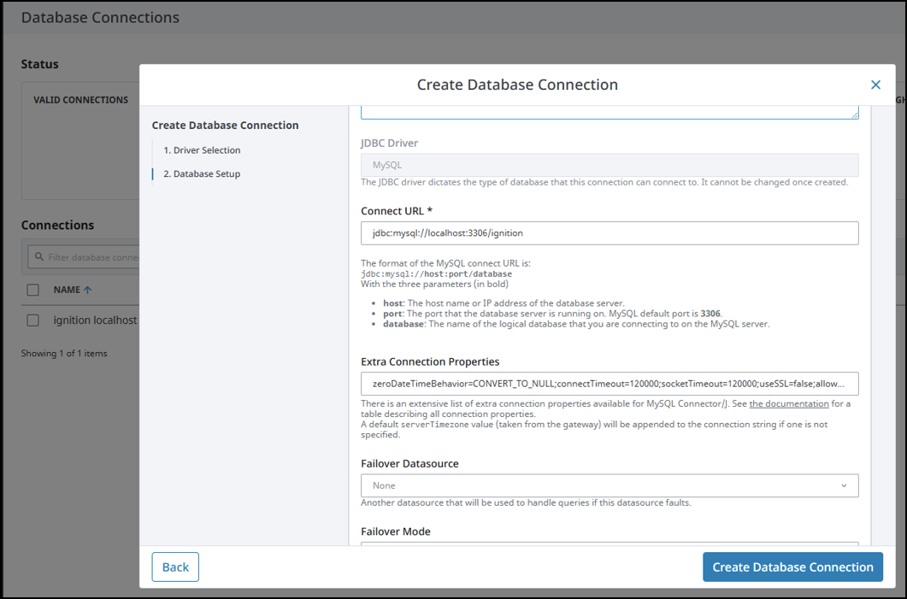

# Introduction

You have your kit all wired and your PLC is programmed!
You have a working OT system.

*Great job!*

THIS is where things get interesting.

This is where we connect our industrial PLC to more traditional ***IT*** systems to:

- Visualize and control the process in centralized control rooms (or across the globe).
- Collect data for Cloud, AI, optimization, and so much more.
- Provide Operations, management, sales, and many more with access to live OT data.

You can see how this is both valuable and complex.
This is probably why there are SO MANY jobs available on LinkedIn for Ignition engineers.

Programming the Ignition HMI is where industrial visualization comes to life. You'll create a user interface for your motor controller that allows operators to control the motor and monitor its usage over time.

The fundamentals you'll learn here are used in power plants, factories, and critical infrastructure worldwide.

In this guide, you'll learn HMI design and programming using Ignition by Inductive Automation.

For more information about Ignition, see [Introducing Ignition](https://www.docs.inductiveautomation.com/docs/8.3/getting-started/introducing-ignition).

Watch the [LIVESTREAM](https://youtube.com/live/We5AOxugrl4) on YouTube!


# Objectives

By the end of this guide, you should understand:

- Ignition HMI design and configuration
- Connecting Ignition to a PLC
- Creating Tags to track process values
- Creating user interfaces for motor control
- Connecting Ignition to MySQL database
- Data logging and Ignition Historian
- Basic SCADA concepts
- How to deploy and run HMI applications

# Prerequisites & Software Setup

Before you start programming, you'll need the Ignition software installed and connected to your hardware.

> [!NOTE]
> See the [Bill of Materials](../BOM.md) for software download links.

## Prerequisites

- Ubuntu 24.04 Virtual Machine
- Ethernet connection from the machine to your PLC and Ignition Gateway
- Installation file for Ignition by Inductive Automation (Free trial or licensed) — Download from [Inductive Automation](https://inductiveautomation.com/)
- Connection to the Internet to download applications like MySQL

# Guide

## Part 1: Installing and Setting Up Ignition

### Downloading and Installing Ignition

1. Go to the Inductive Automation website and download the Ignition installer.

   Choose *Ignition - Linux Installer 64-bit (1.9 GB)*

2. Run the installer and follow the prompts to install the Ignition Gateway.

   ```
   chmod +x ignition-8.3.4-linux-64-installer.run
   ./ignition-8.3.4-linux-64-installer.run
   ```

3. Start the Ignition Gateway service. (it should start automatically).
4. Open a web browser and navigate to `http://localhost:8088` (or the configured port) to compete the installation.

For more information, see [Installing and Upgrading Ignition](https://www.docs.inductiveautomation.com/docs/8.3/getting-started/installing-and-upgrading).

### Connecting to the PLC

1. From the Ignition Gateway portal, click `Configure`.
2. Add a new device connection.
3. Select `Modbus TCP` as the protocol.
4. Enter the device IP Address for your Click PLC CPU Ethernet (mine was 192.168.0.10).
5. Leave the rest. TCP port should be 502 (default for ModbusTCP).
6. If successful, it will say `Connected`.

#### Configuring Ignition to read/write Modbus Addresses in the PLC

1. To the right of the PLC Connection, click the three dots. Then click `Addresses`.
2. Fill out the addresses like in the screenshot below. This will add:

   - Start and Stop button **Discrete Inputs**.
   - Fan motor, Running Light, and Stopped Light **Coils**.


For more information, see [Connecting to a Modbus Device](https://www.docs.inductiveautomation.com/docs/8.3/ignition-modules/opc-ua/opc-ua-drivers/modbus/connecting-to-modbus-device).

### Accessing the Ignition Designer

1. Open a web browser and navigate to `http://localhost:8088` (or the configured port).
2. Log in with the credentials you created during the installation.
3. Click "Launch Designer" in the upper right of the page. This will download and run a Java application.

For more information, see [Designer Launcher](https://www.docs.inductiveautomation.com/docs/8.3/launchers-and-workstation/designer-launcher).

## Part 2: Creating Your First Ignition Project

### Setting Up a New Project

1. In the Designer, create a new project.
2. Configure the project settings.

For more information, see [Vision Ignition Module](https://www.docs.inductiveautomation.com/docs/8.3/ignition-modules/vision).

## Part 3: Designing the HMI Interface

### Creating Screens

1. Design a main screen with motor control buttons (Start/Stop).
2. Add indicators for motor status.

For more information, see [Vision Windows](https://www.docs.inductiveautomation.com/docs/8.3/ignition-modules/vision/vision-windows).

### Motor Control Logic

1. Create tags for motor start/stop commands.
2. Bind buttons to write to these tags.
3. Read motor status from PLC tags.

For more information, see [Tags](https://www.docs.inductiveautomation.com/docs/8.3/tags) and [Vision Components](https://www.docs.inductiveautomation.com/docs/8.3/vision/components).

## Part 4: Tracking Motor Usage

### Installing MySQL Community Edition

Before setting up data logging, we need a database to store the historical data. We'll use MySQL Community Edition.

1. Install MySQL Server.
   ```
   sudo apt install mysql-server
   ```
2. Open the MySQL Command Line Client or MySQL Workbench as root.
   ```
   mysql -u root
   ```
3. Create a new database for Ignition:

   ```
   CREATE DATABASE ignition;
   ```

4. Create a new user for Ignition:

   ```
   CREATE USER 'ignition'@'localhost' IDENTIFIED BY 'password';
   ```

   (Replace 'password' with a secure password)

5. Grant privileges to the user on the database:

   ```
   GRANT ALL PRIVILEGES ON ignition.* TO 'ignition'@'localhost';
   ```

6. Flush privileges:

   ```
   FLUSH PRIVILEGES;
   ```

7. Exit the MySQL client.
   ```
   exit
   ```

This sets up MySQL with a dedicated database and user for Ignition to use.

### Installing the MySQL Connector in Ignition

Unfortunately, Ignition does not ship with a connector for MySQL. We will have to load the Java Database Connector (**JDBC**) for MySQL.

1. Download the [MySQL JDBC](https://dev.mysql.com/downloads/connector/j/).
> [!Note]
> Choose the "platform independent" version. This will provide the `.jar` file we are looking for.

2. In the Ignition Gateway portal, go to `Connections`->`Databases`->`Settings`.

3. You will see MySQL connector has an error. Click on the three dots and and upload the `.jar` file.

4. If you're successful, you will see the MySQL database turn green.

For more information, see [JDBC Connectors in Ignition](https://www.docs.inductiveautomation.com/docs/8.3/platform/database-connections/connecting-to-databases/jdbc-drivers-and-translators).

### Set up a database connection (we'll be using MySQL)

1. In the Ignition Gateway portal, click `Connections` -> `Databases` -> `Connections`.
2. Click `Create new database Connection`.
3. Configure the database settings as in the picture below.

> [!NOTE]
> Don't forget to change `test` to `ignition` at the end of the database URL. (That got me for several hours. lol)




For more information, see [Database Connections](https://www.docs.inductiveautomation.com/docs/8.3/platform/database-connections).

4. If you are successful, you will see a big green `Connected`. Great job!

### Enable the Core Historian Module in Ignition

1. Now that you have a successful connection, you need to enable the **Core Historian Module** in Ignition.

   - From the Ignition Gateway portal, go to `Services` -> `Historians` and click `Core Historian`.

2. The final step is to launch Designer and configure Hostorian for each tag.

For more information, see [Ignition Historian](https://www.docs.inductiveautomation.com/docs/8.3/ignition-modules/vision/historian-in-vision).

### Creating Charts and Reports

1. Add a chart component to display usage over time.
2. Create reports for motor usage statistics.

For more information, see [Easy Chart Component](https://www.docs.inductiveautomation.com/docs/8.3/ignition-modules/vision/historian-in-vision).

## Part 5: Testing & Debugging

### Running Your HMI

1. Publish the project.
2. Open the client and test the interface.
3. Verify motor control and data logging.

### Common Issues & Troubleshooting

- Connection issues with PLC
- Tag configuration errors
- Database setup problems

# Conclusion

You've now learned the fundamentals of HMI programming with Ignition. The concepts you've mastered here scale to complex SCADA systems managing industrial processes.

# Next Steps

Ready to take it further?

Explore advanced Ignition features like scripting, alarming, and multi-user access!

Our next Episode will dive deep into the packet-level ModbusTCP communications between the HMI and the PLC.

***Stay Tuned!!***
