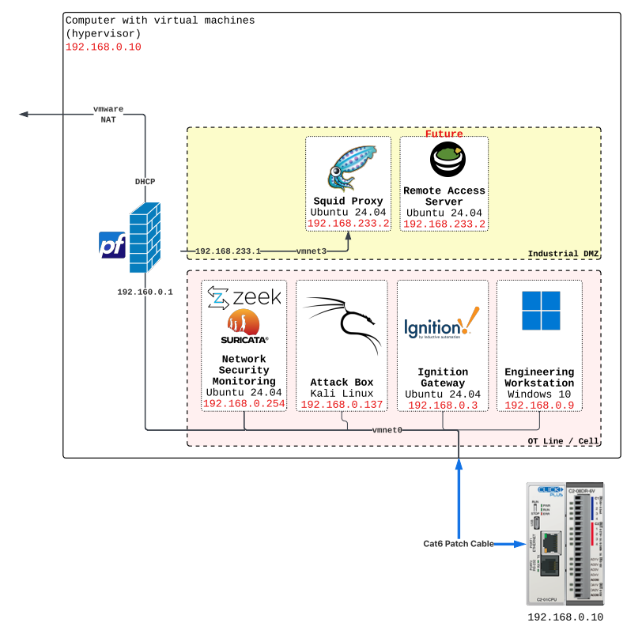
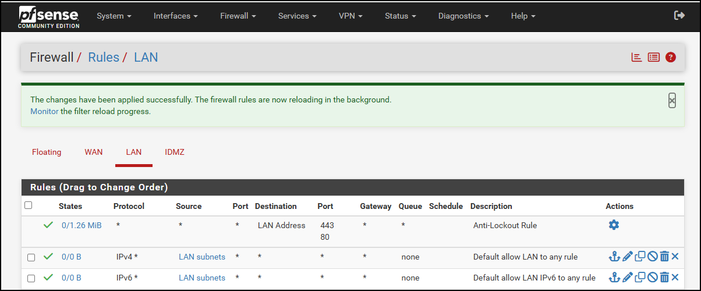
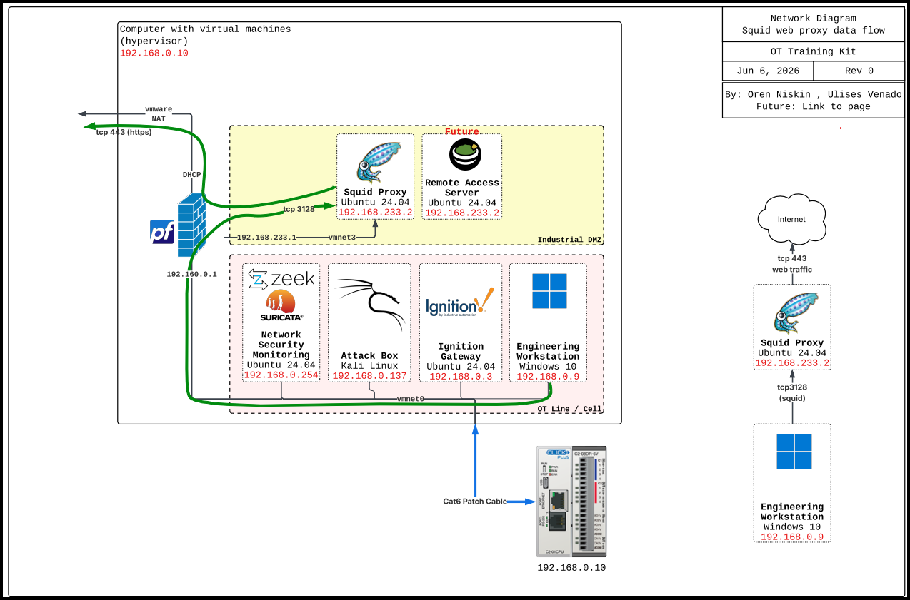
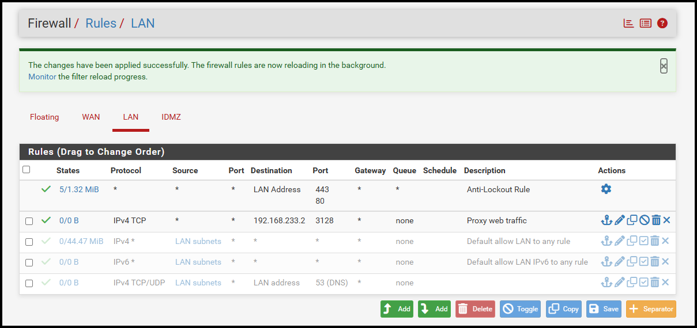
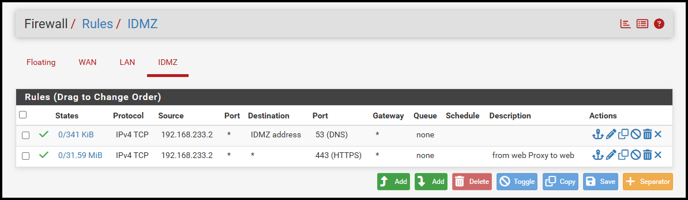
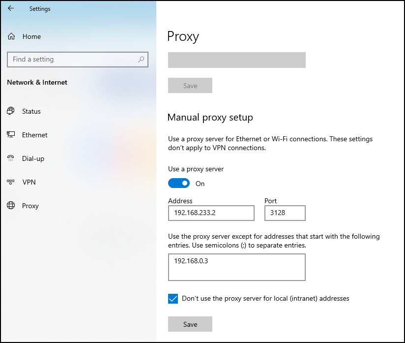
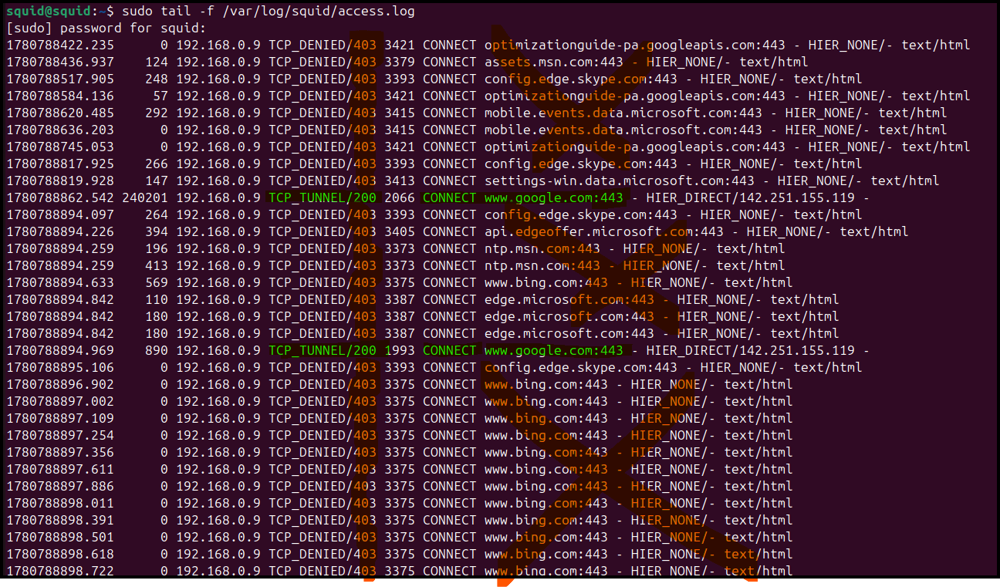

# Introduction

Up to now, everything we've built has been "air gapped." But to be useful, eventually we will need to connect our OT network up to the world.

- **Remote Access** - so you don't need to drive to the plant every time they call you at 3 a.m.
- **Web Services** - Controlling access to the Enterprise and the Cloud!
- **File Transfer** - monitoring file transfers in and out of the OT network.

# What is an Industrial DMZ?

An industrial DMZ is a network that brokers connections into and out of the OT network.

It is a nasty, perilous network that stands between the pristine OT network and the wild Enterprise network!

Key requirements relevant to us:

1. All communications into and out of the OT network terminate in the I-DMZ before being forwarded on.

2. No permanent data storage in the I-DMZ.

Why? Assume data stored here can get stolen. DMZs are nasty places.

3. No industrial process dependencies on systems in the I-DMZ. Connections are just brokered.

Why? During an incident, you can disconnect the I-DMZ and keep attackers out while you keep running your process.

Also, since the I-DMZ is the most exposed network in the plant, minimizing dependencies makes it much simpler to patch systems and perform incident response without worrying about process disruption.

***OK, let's build!!!***

# Architecture

We're adding the following (open source... and FREE!) components:

- pfSense firewall
    - New network interfaces:
    - OT
    - I-DMZ
    - WAN. (Enterprise network coming soon)
- Squid web proxy
    - Any web access from the OT network will be proxied through Squid. We control what is allowed and monitor.



# We need a firewall!

OK, first step is to implement a firewall. We'll use the [pfSense](https://www.pfsense.org/download/). It's open source... and **FREE!**

### Installing the pfSense in VMWare Workstation Pro

1. Download [pfSense](https://www.pfsense.org/download/) ISO. You may need to create an account with Netgate for this.
2. Select the `AMD64 ISO IPMI/Virtual Machines`.
3. Create a new virtual machine:

Open VMWare Workstation Pro. Click `File` -> `New Virtual Machine`.

    - Guide OS Profile: FreeBSD template
    - CPU: 2
    - Memory: 2-4 GB
    - Disk: 20 GB
    - Network Adapter: NAT (WAN)
    - Network Adapter: vmnet0 (OT Network)
    - Network Adapter: vmnet3 (I-DMZ)

Attach the ISO you downloaded to the CDRom drive of your VM.

Boot the VM and install pfSense.

Assign network interfaces as follows:

```
WAN: em0
IP Address: DHCP

LAN: em1
IP Address: 192.168.0.1
Subnet mask bits: 24
DHCP Server? No

OPT1: em2
IP Address: 192.168.233.1
Subnet mask bits: 24
DHCP Server? No
```

Once you have the initial configuration completed, you should be able to browse to `https://192.168.0.1`.

Login with the default username (`admin`) and password (`pfsense`). Change your password.

See [pfSense Manual](https://docs.netgate.com/pfsense/en/latest/usermanager/defaults.html).

### Configuring the Industrial DMZ interface

Login to the firewall's pfSense portal as above.

Click `Interfaces` -> `OPT1`.

Change the name to `IDMZ`.

Click the `Enable` checkbox.

Click `Save`.

### Test initial configuration

With the default ruleset, *IF* you have your networking right, you should be able to browse the Internet from your engineering workstation in the OT Network 

(we'll restrict this in a minute. Don't worry. :D )

These are the rules that allow that communication:



Toggle those ruules to block this communication. We will re-enable access through a web proxy next.

# Squid Web Proxy

We'll use a web proxy to:

1. Restrict access to only authorized web services.

Why can't we just do this with a firewall? Good question!

Firewalls struggle to block access to web sessions to a particular domain, like `google.com`. Firewalls block access to IP addresses or network ports. Firewalls can fake domain access controls through maintaining a list of IPs correlating to certain domain names. But this gets messy with big Cloud companies like Microsoft.

A web proxy brokers the web connection to the desired domain, and is in a much better spot to reliably control access.

2. Monitor and Log connections.

Web proxy logs have much better data quality regarding web traffic.

3. Helps reliably connect isolated systems.

I never knew this, but web proxies like `Squid` actually do the DNS request FOR THE ENDPOINT! So endpoints don't need access to make Internet DNS queries, which removes a whole range of DNS related attacks and complications.

4. Industrial DMZ Architecture

As stated above, all communications should terminate in the Industrial DMZ. Web proxies are a great way to do this.

When connecting through a proxy to Google.com, you will only see the connection to the Proxy on your OT host.

### Squid Proxy Data Flow (Network Path)

When the host in the OT network wants to do something like download a Windows Update, it will reach out through the web proxy:

`OT endpoint` -> `Squid Proxy` on port `TCP 3128` with a web proxy `CONNECT` request.

Squid proxy checks if the requested domain is allowed. If it is, Squid Proxy makes a `DNS Request` to resolve the requested domain.

`Squid Proxy` -> `DNS Server` on port `UDP 53`, which is `DNS`

Squid proxy then establishes the connection and proxies.

`Squid Proxy` -> `Internet` on port `TCP 443`, which is `https`.



### Installing Squid

Start with a clean Ubuntu 24.04 virtual machine as follows:

    - Guide OS Profile: Ubuntu template
    - CPU: 2
    - Memory: 2-4 GB
    - Disk: 20 GB
    - Network Adapter: vmnet3 (I-DMZ)

Configure the network card as follows:

    - IPv4 Address: 192.168.233.2
    - Subnet Mask: 255.255.255.0 (24 bits)
    - Gateway: 192.168.233.1
    - DNS: 192.168.233.1

Install `Sqiid`!

```
sudo apt update
sudo apt install -y squid
```

Verify Squid is running and listening on port 3128:

```
sudo systemctl status squid
sudo ss -lntp | grep 3128
```

### Configuring Squid - Access Control

Before modifying the configuration:

```
sudo cp /etc/squid/squid.conf /etc/squid/squid.conf.original
```

Edit the active configuration: 

`sudo nano /etc/squid/squid.conf`.

Add the following:

```
# <with the ACLs part of the .conf>
acl approved_domains dstdomain "/etc/squid/approved-domains.txt"

# <with the http_access part of the .conf>
# Only allow OT clients going to approved domains
http_access allow localnet approved_domains
```

Verify that the `http_port` is set to `3128`. This is the default port for Squid proxy.

Create a file that will list the allowed domains. These should be things like Windows Update, REQUIRED SaaS services, Cloud endpoint protection, etc.

`sudo nano /etc/squid/approved-domains.txt`

```
.windowsupdate.com
.update.microsoft.com
.download.windowsupdate.com
.delivery.mp.microsoft.com
.dl.delivery.mp.microsoft.com
```

This way our Windows hosts can get patches, but cannot watch streaming videos or read their phishing emails.

Also, malware will not be able to reach out to its Command and Control (C2) server.

For our use case, we'll just put `.google.com` in the file so we can test.

### Validate and Reload Squid

To test your configuration changes:

```
sudo squid -k parse
```

If you don't see any errors, your golden!

Restart Squid to make the changes take affect.

```
sudo systemctl restart squid
sudo systemctl status squid
```

### Adding firewall rules for Squid

First, we need to add rules to the LAN (OT) Interface:

- From: any host in the LAN subnet
- To: Squid Proxy (192.168.233.2)
- Port: TCP 3128



Next, we need ot add rules on the IDMZ interface:

For web traffic:

- From: Squid Proxy (192.168.233.2)
- To: Any host (for now)
- Port: TCP 443 (https)

So Squid can query DNS on behalf of the endpoints:

- From: Squid Proxy (192.168.233.2)
- To: IDMZ Address (192.168.233.1)
- Port: TCP/UDP 53 (dns)



### Configuring our Windows host to use a proxy

On Windows 10: 
1. Go to `Settings`.
2. Click `Network & Internet`
3. Click `Proxy`
4. Toggle `Use Proxy` on.
5. Configure proxy as follows:
    - Proxy IP Address: `192.168.233.2`
    - Port: `3128`
    - Toggle `Don't use the proxy server for local (intranet) addresses`.

This last check box for Intranet access is so the proxy does not interfere with access to our local services like **Ignition**.


    
# Moment of Truth! Time to test...

> [!Note]
>  We only have `.google.com` in our `allowed-domains.txt` file. For testing...

From your windows host:

| Test                       | Action                                                                                         | Expected Result                                                           |
| -------------------------- | ---------------------------------------------------------------------------------------------- | ------------------------------------------------------------------------- |
| ✅ Approved Internet access | Open a browser and navigate to `https://google.com`.                                           | The page loads successfully through the Squid proxy.                      |
| 🚫 Blocked Internet access | Navigate to `https://yahoo.com`.                                                               | Squid blocks the request and displays an `Access Denied` error.           |
| 🏭 Direct local access     | Navigate to the Ignition server at `http://192.168.0.3:8088`, or the address used in your lab. | The Ignition page loads directly without passing through the Squid proxy. |


If you are having trouble:

- Triple check the firewall rules.
- Attempt to load the page from Squid. If it can't load from Squid, it cant load from the OT endpoint.
- Check your Squid access logs: `tail -f /var/log/squid/access.log`.

The ones that say `TCP_DENIED/403` are blocked attempts. They should be for anything other than `google.com`.

The ones with `TCP_TUNNEL/200` mean the proxy `CONNECT` request was permitted and the status code is `200`, which is good.



Got it all working??

OK, now take out google.com form your authorized domains file.

# Next Steps!

In Industrial DMZ Part 2, we'll do the second half of the DMZ.

- Remote Access!
- Secure File Transfer!

Stay Tuned.

# References

1. [Industrial Control System Security, Volume 1](https://www.amazon.com/Industrial-Cybersecurity-Efficiently-critical-infrastructure-ebook/dp/B0761XRTP9?ref_=ast_author_dp&th=1&psc=1), by Pascal Ackerman
2. [Cisco Converged Plantwide Ethernet - Industrial Demilitarized Zone](https://literature.rockwellautomation.com/idc/groups/literature/documents/td/enet-td009_-en-p.pdf), by Cisco and Rockwell Automation
3. [Squid Manual](https://www.squid-cache.org/Doc/)
4. [pfSense Manual](https://docs.netgate.com/pfsense/en/latest/index.html)