# Introduction

**Part 1 Recap** - In the last section, we implemented an Industrial Demilitarized Zone (I-DMZ) network, complete with a pfSense firewall and a Squid web proxy.

**Part 2** - Now we're going to add remote access. This is how plant operators and engineers access the site when they are at home, in the central headquarters office, or even in another country!

A few examples of who would use remote access:

- Specialist support from the people in Japan who designed the system.
- Operators forced to run certain functions from home during COVID19.
- Maintenance personnel trying to get the line running at 3 a.m. from their house. (we're gonna need some coffee)

*The Plan* - Implement an open source remote access system called [Guacamole](https://guacamole.apache.org/). In short, you login to the Guacamole web application and from there you can remotely access hosts in OT through RDP, SSH, or VNC!

But this brings up so many security concerns. :(devilish grin)

[Watch us build this LIVE ON YOUTUBE - LIVESTREAM](https://youtube.com/live/bMkIu6PMIrY?feature=share)

</img>

# What we're building...

This project is split into 2 phases.

1. Installing and Configuring the Guacamole server.
2. Adding the firewall rules.

In the end, we will have something like the image below.

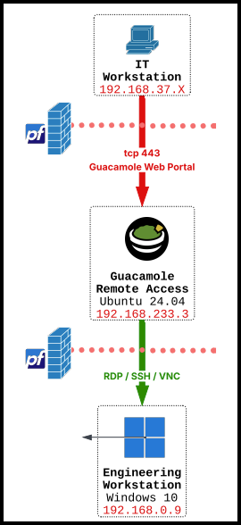</img>

1. Users on the IT network can access a Guacamole remote access portal.
2. They authenticate with local Guacamole credentials (we'll add on to this later)
3. The user enters their MFA token code.
4. The OT hosts they are allowed to access will populate.
5. They click on one to initiate a remote access session over RDP/SSH/VNC.
6. They enter their credentials for the system they are attempting to access.
7. Voila! Remote Access!

This process is similar to my favorite I-DMZ architectural design reference, the [CPwE](https://literature.rockwellautomation.com/idc/groups/literature/documents/td/enet-td009_-en-p.pdf)!

But more importantly, this process is VERY typical of OT remote access systems found in production.

Now, let's build it.

# Prerequisites

- Ubuntu 24.04 VM
- Industrial DMZ setup from Eipsode 9.
- Windows Engineering Workstation

# Installing Guacamole

You can install Guacamole natively on Ubuntu or download and run the Guacamole Docker image.

We chose the Docker path since it seemed more straight forward.

### Installing Docker

If you don't have it, you'll need to [install Docker on your Ubuntu VM](https://docs.docker.com/engine/install/ubuntu/). We've summarized the steps below.

Add Docker's official GPG key:

```
sudo apt update
sudo apt install ca-certificates curl
sudo install -m 0755 -d /etc/apt/keyrings
sudo curl -fsSL https://download.docker.com/linux/ubuntu/gpg -o /etc/apt/keyrings/docker.asc
sudo chmod a+r /etc/apt/keyrings/docker.asc
```

Add the repository to APT sources:

```
sudo tee /etc/apt/sources.list.d/docker.sources <<EOF
Types: deb
URIs: https://download.docker.com/linux/ubuntu
Suites: $(. /etc/os-release && echo "${UBUNTU_CODENAME:-$VERSION_CODENAME}")
Components: stable
Architectures: $(dpkg --print-architecture)
Signed-By: /etc/apt/keyrings/docker.asc
EOF
```

Install Docker!

```
sudo apt update

sudo apt install docker-ce docker-ce-cli containerd.io docker-buildx-plugin docker-compose-plugin
```

Test Docker installation!

```
sudo systemctl status docker
sudo docker run hello-world
```

### Installing Guacamole!

Create the application folders

```
mkdir -p ~/guacamole/db-init
cd ~/guacamole
```

Generate the official PostgreSQL database initialization script

```
sudo docker run --rm guacamole/guacamole /opt/guacamole/bin/initdb.sh --postgresql > ~/guacamole/db-init/initdb.sql
```
Create your docker-compose.yml file
(Paste the final YAML configuration in this folder into this file)

```
nano docker-compose.yml
```

Start the deployment in detached mode

```
sudo docker compose up -d
```

# Adding the Firewall Rules To Permit Remote Access

In your pfSense firewall, we need to add some rules.

### Add Firewall Rules to Allow IT hosts to access the Guacamole portal

First, you'll need to add a rule to allow users in the "IT" network access the Guacamole remote access portal.

For now, we do not have a full "IT" network, so we will just use our host. We'll add IT later.

First, create a port forwarding rule so that whenever you browse to https://[firewall-WAN-IP]:8080/guacamole/, the firewall forwards the request to the Guacamole server.

Click ```Firewall``` -> ```NAT```

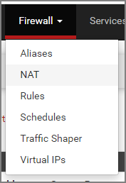</img>

Add the port forwarding rule as follows.

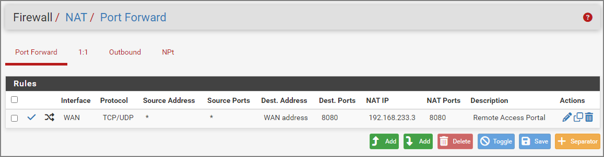</img>

Now, when someone on the WAN interface browses to ***https://[Firewall-WAN-IP]:8080/guacamole***, it will get forwarded to the Guacamole server at 192.168.233.3.

Now, we need a firewall rule permitting this traffic from the WAN subnet to the Guacamole server.

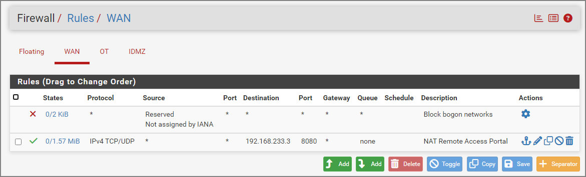</img>

Now, you should be able to browse to your Guacamole server and if you've done everything right, you'll see a login page!

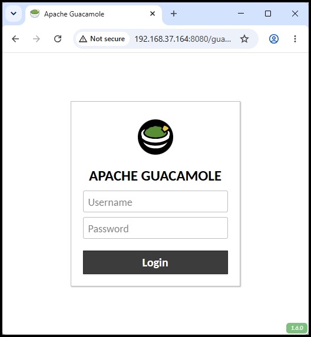</img>

See it? Great Job!

Don't see it? Drop the screenshot into ChatGPT and see where it went wrong. Or contact us on Discord!

Alot of challenges happen during these first steps.

### Add Firewall Rules to Allow RDP from Guacamole server to OT Windows hosts

OK! Now we need to allow traffic from the Guacamole server to our Windows hosts in OT over Remote Desktop Protocol (RDP) port ```3389```.

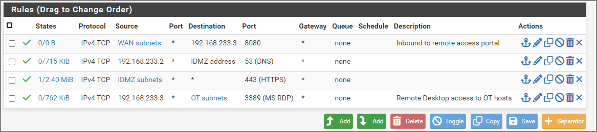</img>

Next, we need to test that we can access the Windows hosts from our Guacamole server over RDP using a normal RDP client. 

If the client doesn't work on the Guacamole server, the Guacamole application will not be able to make the RDP connection either.

If you don't have an RDP client, Install [Remmina](https://remmina.org/), an Ubuntu RDP Client.

```
sudo apt update && sudo apt install remmina -y
```

Try to RDP to your engineering workstation in OT at ```192.168.0.9```.

If you can login and access the desktop, **you're good!**

IF not:
1. Make sure you have RDP access enabled on the Windows host.
2. Troubleshoot your firewall rules. (welcome to IT! lol)

# Configuring Guacamole!

Now we're cooking with GAS!

We have our server setup and our networking is configured correctly.

### Logging into the Guacamole web portal

From your host, you should be able to browse to https://[FIREWALL]:8080/guacamole/

Login with the default credentials:

- User: ```guacadmin```
- Password: ```guacadmin```

You should definitely change this password. Default passwords = BAD.

### Adding your first Connection

A *Connection* is an access point that the Guacamole server can reach, like RDP to our Windows Engineering Workstation.

To add a connection, click your user in the top right and click ```Settings```.

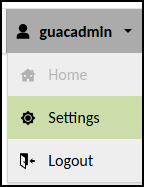</img>

Next, add a connection.

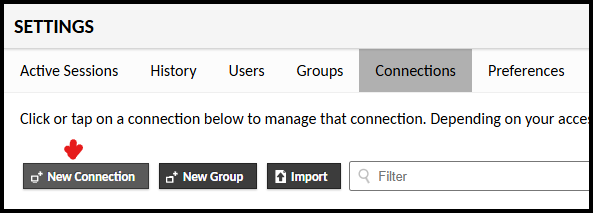</img>

Next, fill in the details as shown in this image.

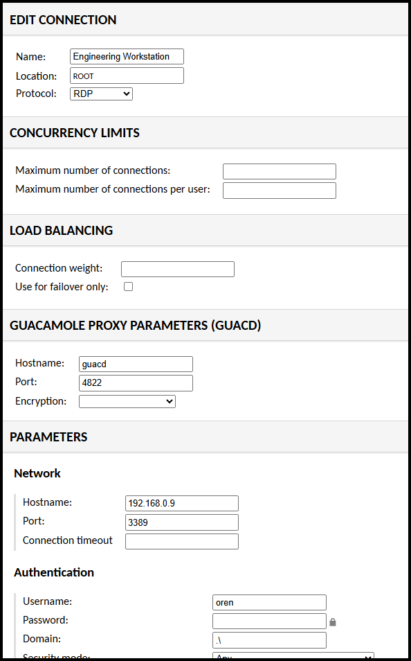</img>

Now, click your user in the top right again and click ```Home```.

Click on the ```Engineering Workstation``` connection. If you've done everything correctly, it should give you a password prompt!!

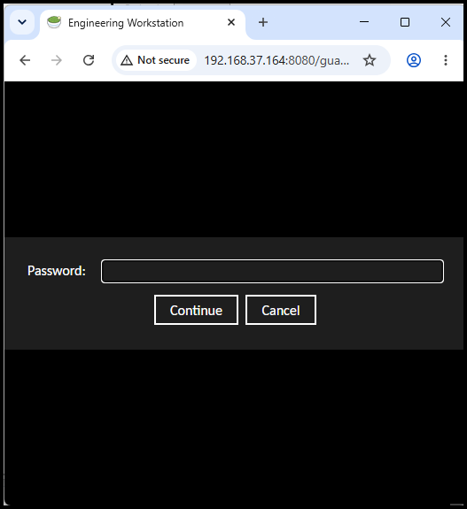</src>

Enter your password and Bob's your uncle! You've got remote access! 

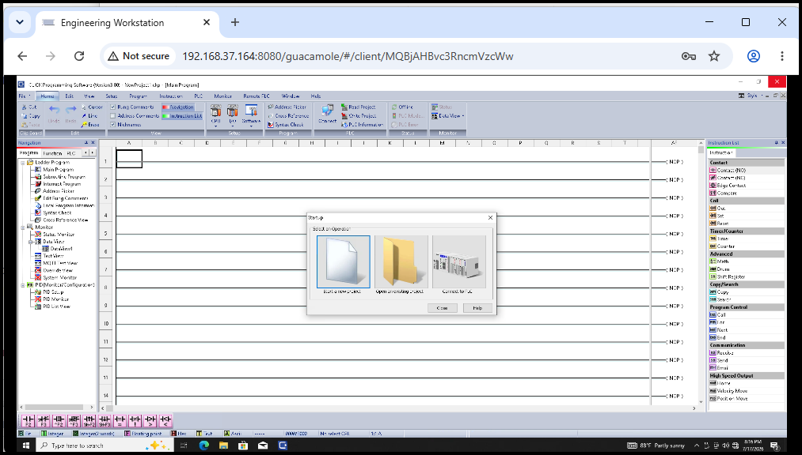</src>

***How cool is that?!***

# References

1. [Industrial Control System Security, Volume 1](https://www.amazon.com/Industrial-Cybersecurity-Efficiently-critical-infrastructure-ebook/dp/B0761XRTP9?ref_=ast_author_dp&th=1&psc=1), by Pascal Ackerman
2. [Cisco Converged Plantwide Ethernet - Industrial Demilitarized Zone](https://literature.rockwellautomation.com/idc/groups/literature/documents/td/enet-td009_-en-p.pdf), by Cisco and Rockwell Automation
3. [Docker](https://docs.docker.com/)
4. [Apache Guacamole Project](https://guacamole.apache.org)
5. [TOTP MFA in Guacamole](https://guacamole.apache.org/doc/1.6.0/gug/totp-auth.html)
