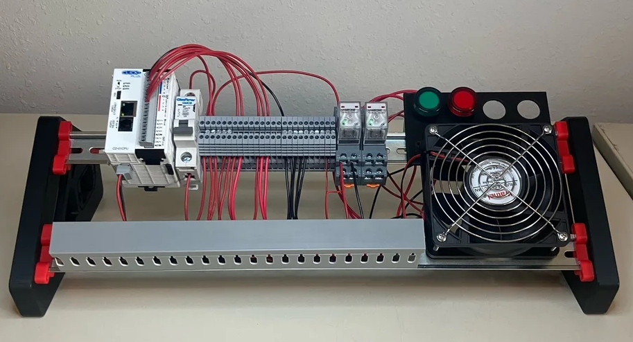

# PLC-Trainer-Kit 🚀

**Packets-or-it-didn't-happen PLC Trainer Kit** gives you real, hands-on experience with industrial control systems, PLCs, HMIs, and OT security — without expensive factory hardware.

> Learn how the systems behind factories, refineries, power plants, water utilities, and industrial operations really work.

---

## Why this kit is awesome 🔥

👷 Get hands-on OT experience with **PLCs, HMIs, networking**

🏭 Affordable, real factory equipment

⚡ Gain practical skills that bridge cyber and operational technology

## What you'll learn 📚

### 🛠️ Build
- PLC hardware assembly
- PLC field wiring
- Ladder logic programming
- Modbus TCP protocol
- Ignition HMI design
- Motor controller integration

### 🎯 Attack
- OT network reconnaissance
- Process takeover simulation
- Modbus man-in-the-middle attacks
- HMI takeover scenarios

### 🌱 Contribute
- Add new attack paths
- Extend OT functionality
- Share improvements with the community

    ***THIS IS WHY IT'S ON GITHUB, PEOPLE!*** **Send me alllll your pull requests**

---

## Kit Options 💡

| Option | Best for | What you get |
|---|---|---|
| 1. [DIY Kit](https://orenniskin.com/store) | Learners who want the deepest experience | Kit components, screwdriver, and optional VM access |
| 2. [Fully Assembled Kit](https://orenniskin.com/store) | Fast setup and immediate hacking | Prebuilt physical kit, screwdriver, and VMs |
| 3. [Component-Only](Guides/BOM.md) | Budget builders & students | Buy parts from the [BOM](Guides/BOM.md) and assemble yourself |

> Ready to get started? Check the [store](https://orenniskin.com/store) or open the guides for full instructions.

---

## Build with us 🧩

I’m streaming the build process live — follow along and learn each step in real time.

- [Episode 1: Demo-ing the kit — what is this thing?](https://www.youtube.com/live/a5_kdfI3hPU?si=9CvtAl6AMEbSubjH)
- [Episode 2: Wiring the PLC](https://youtube.com/live/yhx_D9G6TL8)
- [Episode 3: Programming the PLC](https://youtube.com/live/xun7izINi8M)
- [Episode 4: Programming the HMI](https://youtube.com/live/We5AOxugrl4)

> Subscribe to [@PacketsOrItDidntHappen on YouTube](https://www.youtube.com/@PacketsOrItDidntHappen) for updates and new episodes.

---

## Step-by-step guides 🧭

Everything is organized in the `Guides/` folder. Start with the intro and follow the wiring, programming, and HMI chapters.

- `Guides/1-Kit-Intro/README.md`
- `Guides/2-Wiring-The-PLC/README.md`
- `Guides/3-Programming-The-PLC/README.md`
- `Guides/4-Programming-The-HMI/README.md`

---

## Ready to learn industrial control systems? ⚙️

This kit is designed for hackers, students, and OT security enthusiasts who want a real physical lab experience, not another VM.
